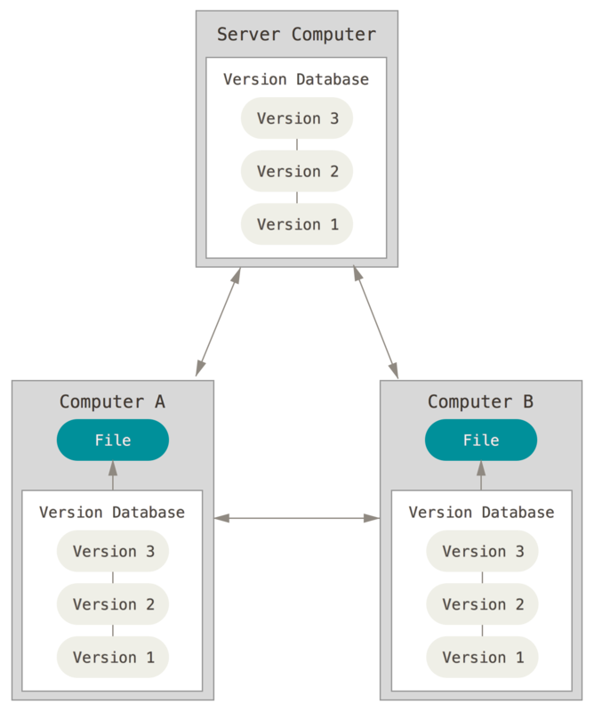
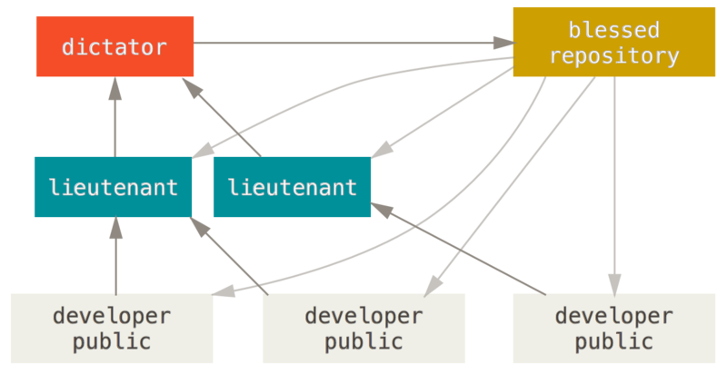

.. include:: ../../common/rst_defs.rst

.. {{{ Introduction

git
===

* |home| http://git-scm.com

.. include:: ../../common/introduction.rst

.. }}}

.. {{{ Outline of Version Control

What is Version Control
-----------------------

* Like "track changes" in MS-Office™ products… on steroids.
* Primarily for plain-text files (f.ex.: source code).
* Binary files (f.ex. MS-Word™ documents) are supported, but many features will
  not work.
* Visualising changes in files (diffing).
* Undo those changes easily.
* **Branching**
* Conflict handling/resolution.

Version Control Models
----------------------

================== =======================
 Name               Model
================== =======================
 CVS                Client/Server
 SVN                Client/Server
 ClearCase          Client/Server
 Perforce           Client/Server
 TFVC (TFS)         Client/Server
 Visual SourceSafe  Client/Server
 Bazaar             Distributed
 Mercurial          Distributed
 git                Distributed
================== =======================

Distributed vs. Client/Server
-----------------------------

Centralised (Client/Server)
~~~~~~~~~~~~~~~~~~~~~~~~~~~

.. figure:: _static/images/centralized.png
    :align: left
    :width: 340px

    CC BY-NC-SA 3.0 by Scott Chacon

.. sidebar:: Summary

    * |OK| One place to apply access rights.
    * |OK| Reduced number of merge conflicts.
    * |XX| Single point of failure.
    * |XX| Network access required.

Distributed
~~~~~~~~~~~

    CC BY-NC-SA 3.0 by Scott Chacon

.. sidebar:: Summary

    * |OK| Supports larger teams (infinite scale).
    * |OK| Access control works like a "Web of Trust".
    * |OK| No connection to server required (working off-line).
    * |OK| Can support very complex workflows (f.ex.: code-review, "tenured"
      repositories, …).
    * |XX| Increased risk of merge conflicts.

.. }}}

.. {{{ git

Git
---

* Fully distributed
* Stream of snapshots instead of history of deltas.

  * Latest snapshot is kept in full. After packing, a similar approach to
    deltas is used (using packfiles).

* Nearly all operations executed locally.
* Strong integrity (SHA1 hashes of snapshot content).
* Possibility to modify any aspect of a commit even after it's made.
* Distinguishes between "author" and "committer".
* Possibility to digitally sign commits.

.. note::

    See
    http://stackoverflow.com/questions/5176225/are-gits-pack-files-deltas-rather-than-snapshots
    for more details on how git stores changes.

History of Deltas
-----------------

.. figure:: _static/images/deltas.png

    CC BY-NC-SA 3.0 by Scott Chacon

Snapshots
---------

.. figure:: _static/images/snapshots.png

    CC BY-NC-SA 3.0 by Scott Chacon

Installing
----------

* Linux
    .. code-block:: bash

        $ sudo yum install git
        $ sudo aptitude install git
* MacOS

  * Run XCode
  * Run ``git`` in a terminal

* Windows

  * Official client: http://git-scm.com/download/win
  * Github for Windows: http://windows.github.com

.. }}}

.. {{{ Key terms

Key Terms
---------

working copy
    The files you are working with, the files you see on your disk, your copy
    of the source-code.

index
    A "staging area" to prepare the next commit.

commit
    A snapshot of the source code. These are points in time you can come back
    to.

repository
    This is where all the history (commits) and related metadata (tags,
    branches, …) are stored.

.. }}}

.. {{{ collaboration / repo setups

Collaboration
=============

One Reference Repo
------------------

.. figure:: _static/images/centralized_workflow.png
    :align: center

    CC BY-NC-SA 3.0 by Scott Chacon

.. nextslide::
    :increment:

* Very similar workflow to a centralised VCS. No new tricks to learn.
* Good for small teams.
* Easy to manage.
* Developers do not need to make their repositories public.

.. admonition:: Info

    "Public" here does not necessarily mean public to the world. It only means
    that someone else than the author has access to the repo!

    Note that instead of a public repository, git also makes it easy to
    contribute changes via e-mail.

Integration Manager
-------------------

.. figure:: _static/images/integration-manager.png
    :align: center

    CC BY-NC-SA 3.0 by Scott Chacon

.. nextslide::
    :increment:

* Mostly distributed.
* Integration manager has control over what patches (changes) are accepted.
* Good for projects with dynamic teams.
* Developers need to provide a public repository.

Beneveloent Dictator Model
--------------------------

    CC BY-NC-SA 3.0 by Scott Chacon

.. nextslide::
    :increment:

* Better control over contributed code.
* Essentially a Web of Trust (WoT).
* Good for very large projects with large teams.
* Used to manage the Linux source code.
* Developers need to provide a public repository.

.. }}}

.. {{{ Workflow

Example Commit Workflow
-----------------------

.. figure:: _static/images/nvie-workflow.png
    :width: 350
    :align: center

    See: http://nvie.com/posts/a-successful-git-branching-model/

Workflow Branches
-----------------

master
    One commit per release.

develop
    Ongoing work

release/*
    Feature freeze for release / metadata & doc updates

hotfix/*
    Bugfixes

feature/*
    Work for one specific feature.

Version Numbers
---------------

* Semantic versioning (http://www.semver.org)
* Very good for application interfaces.
* More difficult for user interfaces.
* major, minor, patch

  * **major** backwards *incompatible* changes.
  * **minor** backwards compatible changes.
  * **patch** bugfixes.

.. }}}

.. {{{ hands-on

Hands-on git
============

.. {{{ Configuration

Configuration
-------------

* ``/etc/git``
* ``~/.gitconfig`` (or ``~/.config/git/config``)
* ``.git/config``

.. code-block:: ini
    :caption: Example ~/.gitconfig

    [user]
    name = John Doe
    email = john.doe@example.com

    [core]
    editor = vim

    [alias]
    st = status -s

.. nextslide::
    :increment:

core.editor
    Which editor to run for interactive prompts

commit.template
    The filename of a file which gets loaded by default into the commit
    message.

core.excludesfile
    Your personal, global excludes file. This should not contain
    project-specific values.

help.autocorrect
    Automatically correct minor misspellings in git commands (``git checkut``
    -> ``git checkout``)

.. nextslide::
    :increment:

merge.tool
    Which tool to use by default when running ``git mergetool``.

diff.tool
    Which tool to use by default when running ``git difftool``.

core.autocrlf
    How to handle CRLF issues (should be set to "true" on Windows).

.. }}}

.. {{{ help

Help
----

.. code-block:: bash

    $ git help <verb>
    $ git <verb> --help
    $ man git-verb

.. }}}

.. {{{ areas

git Areas
---------

.. figure:: _static/images/areas.png
    :align: center

    CC BY-NC-SA 3.0 by Scott Chacon

.. }}}

.. {{{ essential commands

Essential Commands (local)
--------------------------

``git init``
    Create an empty git repository or reinitialize an existing one

``git add``
    Add file contents to the index

``git status``
    Show the working tree status

``git commit``
    Creates a new snapshot from the index.

``git log``
    Shows the timeline of changes.

.. nextslide::
    :increment:

``git checkout``
    Gets a branch or path/file into the working directory. This is *not* the
    same as ``checkout`` in SVN!

``git stash``
    Sets local changes aside and resets the working copy.

``git show``
    Displays the content of any git object (commit, branch, tag, tree, …)

``git reset``
    Moves the ``HEAD`` pointer. Can be used (among other things) to drop all
    pending (non-committed) changes.

``gitk``
    Launches a graphical history browser.

.. }}}

.. {{{ exercise 1

Exercise 1 -- Day-to-day
------------------------

Covered commands:

* ``git init``
* ``git add``
* ``git commit``
* ``git log``
* ``git status``
* ``git show``
* ``gitk``

.. nextslide::
    :increment:

Create a new project:

.. code-block:: bash

    $ mkdir project
    $ cd project
    $ git init                  # Create the repository

Day-to-day essentials:

.. code-block:: bash

    $ vim document.txt       # Create a simpe file
    $ git status             # What does git see?
    $ git add document.txt   # Stage the file for commit
    $ git status             # How is the status now?
    $ git commit             # Finalize the commit
    $ git status             # How is the status now?
    $ git log                # Show the history.

.. nextslide::
    :increment:

Making changes:

.. code-block:: bash

    $ vim document.txt
    $ git status
    $ git add document.txt
    $ git status
    $ git commit
    $ git status
    $ git log

Also try:

.. code-block:: bash

    $ git show HEAD
    $ gitk

The Index
---------

.. digraph:: example

    rankdir="LR";
    node [shape="circle"];
    {
        rank="same";
        d [style="dotted"];
        index [shape="plaintext"];
    }

    {
        rank="same";
        c;
        HEAD [shape="cds"];
    }

    {
        rank="same";
        e [shape="plaintext"];
        "Working Copy" [shape="plaintext"];
    }

    history [label="...", shape="plaintext"];
    history -> a -> b -> c -> d -> e[dir="back"];
    index -> d;
    HEAD -> c;
    "Working Copy" -> e [arrowhead="empty"];

* The Index is a "staging" area.
* Can be used to prepare a commit by only adding select diffs.
* Changes are staged using ``git add [-p] [filename]``
* |ell| and unstaged using ``git reset [filename]``

Fixing the last commit
----------------------

Forgot to add a file in the last commit? Or realised you have a typo? Maybe you
want to change the commit-message?

::

    git commit --amend

This "unwinds" the last commit, merges your changes with those changes and
re-applies the commit.

.. warning::

    Don't do this after pushing! This **changes history**

.. hint::

    Advanced history fixing can be done using ``git reset`` and ``git rebase
    -i``.

Partial (patch) committing
--------------------------

* Git allows you to add changes piece by piece to the index before committing
  (``git add -p``).
* Use it if your current changes contain more than one logical modification.
* Type ``?`` to get help. It is *really* well written!
* Also works for:

    * ``git stash save -p``
    * ``git checkout -p <revision> -- <filename>``
    * ``git commit -p``

.. }}}

.. {{{ exercise 2

Exercise 2 -- Undoing
---------------------

New commands:

* ``git diff``
* ``git checkout``
* ``git reset``

.. nextslide::
    :increment:

* Open ``document.txt`` and make some changes.
* Run ``git status``, inspect the output.
* Run ``git diff``, inspect the output.
* Run ``git checkout document.txt``.
* Run ``git status`` again.

Undoing changes in the *whole tree*::

    git reset --hard

.. }}}

.. {{{ Advanced Undoing

Advanced Undoing
----------------

* The most common commands for undoing are:

    * ``git reset`` moves the ``HEAD`` pointer around in history. Using
      ``--hard`` **will discard all local changes**!
    * ``git checkout`` can retrieve a file from a specific point in time, into
      the current working-folder. **Any uncommitted modifications are lost!**
    * ``git revert`` will take an existing commit object and apply it *in
      reverse* to the current working folder. This will pause on conflicts as
      usual.

.. nextslide::
    :increment:

If you messed up the last *n* commits, and you want to completely wipe them,
use::

    git reset --hard <revision>

.. hint::
    Omit ``--hard`` if you want to see what's happening first.

.. warning::
    This changes history! Don't do this after other people have based work off
    of yours (f. ex.: after pushing).

.. nextslide::
    :increment:

If you want to retrieve a specific file from history, use::

    git checkout <revision> -- <filename>

.. hint::
    This is a "harmless" modification and can be used after pushing. It will
    only get the file contents of the given revision. You still have to commit
    the new change, so it will appear in the history.

.. nextslide::
    :increment:

If an older commit (f. ex.: ``c0ffee``) introduced a bug, revert it using::

    git revert c0ffee

.. }}}

.. {{{ specifying commits

Specifying Commits
------------------

* Your current location: ``HEAD``
* The direct parent of the last commit: ``HEAD^``
* The second parent of the last commit: ``HEAD^2`` (only makes sense for merge-commits).
* *n* items back in history: ``HEAD~n``
* Any named reference (branch-names, tags)

.. hint::

    You can use ``git rev-parse <symbol>`` to convert a symbolic name to a
    SHA-1.

.. }}}

.. {{{ intermediate git commands

Intermediate Commands
---------------------

``git merge``
    Integrates someone elses work or branch into your current working copy.

``git rebase``
    Attaches a branch to another commit (rewriting each commit!).

``git rebase -i <commit>``
    Allows you to modify the history from the given commit up to ``HEAD``

``git bisect``
    Runs a binary search to find a commit which introduced a bug

.. nextslide::
    :increment:

``git log -S<pattern>`` (pickaxe)
    Searches for commits which introduced a specific change.

``git cherry-pick``
    Takes a single commit (from any branch) and applies it to the current
    branch. The old commit still remains.

.. }}}

.. {{{ Branching

Branching
=========

Creating a new branch
---------------------

To create a branch, run::

    git checkout -b <branch-name>

This will create a new branch with the current ``HEAD`` as parent **and**
switch to it.

All branch operations are available under the ``git branch`` command. It can
also delete (``-d``) and rename (``-m``) branches.

.. nextslide::
    :increment:

.. hint::
    An alternative command is::

        git branch <branch-name>

    This will create the new branch *without* switching to it. It will have the
    current ``HEAD`` as parent.

.. {{{ exercise 3

Exercise -- Branching
---------------------

New commands:

* ``git checkout`` :small:`(new usage)`
* ``git branch``

.. nextslide::
    :increment:

.. code-block:: bash

    $ git branch myvariant
    $ git branch
    $ git checkout myvariant
    $ git branch

Now make some changes as before, and commit them. To switch between branches,
use ``git checkout``.

.. code-block:: bash

    $ git checkout master
    $ cat document.txt
    $ git checkout myvariant
    $ cat document.txt

.. }}}

.. {{{ merging

Merging
-------

.. sidebar:: Fast-Forwards

    When the latest commit on a branch is the sole descendant of the
    branch-point, git does a so-called "fast-forward". In this case no new
    "merge-commit" object is created. Instead git simply moves the target
    branch pointer forwards.

When finished with a branch, you can simply switch to the target branch, and
merge your branch::

    git checkout master
    git merge myvariant
    git branch -d myvariant

Fast-Forward Merge
------------------

Merge Commit
------------

Conflicts
---------

.. sidebar:: Conflict Markers

    Conflicts in git are created similarly to other VCSs by inserting "markers"
    into the source code. For example::

        <<<<<<<
        This is your code
        =======
        This is someone elses code
        >>>>>>>

When the merged branches both contain changes to the same line, git pauses the
process for you to fix the conflict. You can inspect the paused situation using
``git status``. In this case you need to:

* Fix the conflicted files (manual or with ``git mergetool``)
* Add the files to the index.
* Run ``git commit``

.. }}}

.. {{{ exercise

Exercise -- Conflict
--------------------

.. code-block:: bash

    $ git checkout -b othervariant # same as "git branch x; git checkout x"
    $ vim document.txt
    $ git commit -a
    $ git checkout master
    $ vim document.txt
    $ git commit -a
    $ git merge othervariant

Resolve the conflict by editing ``document.txt`` and running:

.. code-block:: bash

    $ git add document.txt
    $ git commit

.. }}}

.. {{{ remotes

Remotes
=======

.. {{{ commands

Remote Commands
---------------

``git clone``
    Clone a repository into a new directory. This is *not* the same as
    ``checkout`` in SVN!

``git fetch``
    Download the latest work (objects and "refs") from the named remote. This
    does *not* merge any changes!

``git push``
    Sends changes **to** a remote repository (f.ex. the server). Does *not*
    include tags automatically.

``git pull``
    Fetches changes **from** a remote repository (f.ex. the server). Runs ``git
    fetch`` and ``git merge``.

.. nextslide::
    :increment:

``git remote``
    Adds (``git remote add``), removes (``git remote rm``) or lists (``git
    remote -v``) remotes.

``git push --tags``
    Sends tags to the remote.

``git branch -avv``
    List all branches (including remotes), including "refs" and their latest
    commit.

``git push <remote> --delete <branch>``
    Deletes a branch on a remote.

``git push <remote> <localbranch>:<remotebranch>``
    Pushes a branch to the remote, using a different name.

.. }}}

Example Remote Interaction
--------------------------

.. figure:: _static/images/small-team-flow.png
    :align: center
    :height: 500px

    CC BY-NC-SA 3.0 by Scott Chacon

Supported Protocols
-------------------

* smart http(s) :small:`— git ≥ 1.6.6`
* dumb http(s) :small:`— git < 1.6.6`
* ssh
* local
* git

.. note::

    See https://git-scm.com/book/en/v2/Git-Internals-Transfer-Protocols for a
    detailed difference between the "dumb" and "smart" protocol.

Working with remotes
--------------------

.. sidebar:: Tracking Branches

    A "tracking" branch is a branch that has an entry in ``.git/config`` such
    that pulling and pushing does not require any arguments. Created using
    ``checkout -t`` or ``push -u``.

.. note::

    In recent versions of git, checking out a remote branch automatically adds
    entries to ``.git/config`` to track it. Even without specifying ``-t``

* Remote branches are *NOT* writable!
* First, create a new *local* "tracking" branch using ``git checkout <branch>``.
* Pull syntax: ``git pull . <remote>/<branch>``

    * Alternative to pull: ``git fetch && git merge <remote>/<branch>``

* Push syntax: ``git push [-u] <remote> <branch>``

Bare repositores
----------------

.. note::
    In git, repositories with an existing working copy are not writable. Only a
    so called "bare" repository is writable.  So, in order get a writable
    repository onto a shared location (server, nfs, local fs), you first need a
    "bare" repository. This is essentially the contents of your ``.git``
    folder. In other words: The project *without working copy*.

* Have no working copy.
* Are writable (as opposed to normal repositories).
* Can be shared (server, NFS, local file-system).
* Created using ``git clone``

.. code-block:: bash

    $ git clone --bare <url>

Some server application handle this for you (f.ex.: gitlab_, gitolite_,
github_, bitbucket_).

.. _gitlab: http://www.gitlab.com
.. _gitolite: http://www.gitolite.com
.. _github: http://www.github.com
.. _bitbucket: http://www.bitbucket.org

If you have write access to a remote bare repository, you can sync your work
with it using ``git pull`` and ``git push``.

.. TODO
.. .gitignore
.. tag        Create, list, delete or verify a tag object signed with GPG
..      Remote tracking branches
..      push origin --delete <targetbranch>

.. }}}

.. }}}

.. {{{ hooks

Hooks (client-side)
-------------------

.. note::

    This list omits hooks used in an e-mail workflow as we rarely use them.

* User runs ``git commit``
* ``pre-commit``
* ``prepare-commit-msg``
* User edits and saves the commit message
* ``commit-msg``
* Commit is finalized.
* ``post-commit`` (Cannot abort commit).

Example client-side hook
------------------------

.. code-block:: bash
    :class: smaller
    :caption: pre-commit

    #!/bin/bash

    # Check if this is the first commit, or a regular commit.
    if git rev-parse --verify HEAD >/dev/null 2>&1
    then
    	# Regular commit
    	against=HEAD
    else
    	# Initial commit: diff against an empty tree object
    	against=4b825dc642cb6eb9a060e54bf8d69288fbee4904
    fi

    OUT=$(git diff --cached $against | grep "^+.*# XXX")

    if [[ "$OUT" != "" ]]; then
        echo "This commit would introduce an XXX marker!"
        echo $OUT
        exit 1
    fi

Hooks (server-side)
-------------------
* User runs ``git push``
* git updates the remote references (locally).
* ``pre-receive``
* ``update``
* git finalizes the push
* ``post-receive`` (Cannot abort push!)

.. }}}

.. }}}

.. TODO (un)tracked, unmodified, modified, staged
.. TODO diff       Show changes between commits, commit and working tree, etc
.. TODO    --staged/--cached
.. TODO    --difftool
.. TODO rm         Remove files from the working tree and from the index
.. TODO    --cached
.. TODO mv         Move or rename a file, a directory, or a symlink
.. TODO    equivalent to remove -> add
.. TODO log        Show commit logs
.. TODO    >> git clone https://github.com/schacon/simplegit-progit
.. TODO    Author vs. Committer
.. TODO    --since/--after, --until/--before
.. TODO    --author
.. TODO    --grep (--all-match)
.. TODO    -S
.. TODO    -L
.. TODO    <from>..<to>
.. TODO == REWRITING HISTORY ==
.. TODO      rebase     Forward-port local commits to the updated upstream head
.. TODO          -i
.. TODO == ON THE SERVER ==
.. TODO      bare repositories
.. TODO      protocols
.. TODO          local
.. TODO          http(s), smart (1.6.6+)/dumb
.. TODO          ssh
.. TODO          git
.. TODO      git-shell in /etc/passwd
.. TODO == WORKFLOWS ==
.. TODO      email-based
.. TODO stash
.. TODO == ADVANCED STUFF ==
.. TODO      manual merging

.. TODO grep       Print lines matching a pattern
.. TODO show       Show various types of objects
.. TODO bisect     Find by binary search the change that introduced a bug

.. {{{ git hosting

git hosting
===========

gitolite
--------

http://www.gitolite.com

* Very simple SSH based management tool.
* Only requirement is a SSH server.
* Management is handled directly via git.
* Easy to set up.
* Very low maintainance.
* Self-Hosted

gitlab
------

https://www.gitlab.com

* Free
* Self hosted
* Similar to github
* Contains other useful feautures on top of simple git management.

  * CI
  * Automated Tasks
  * Issue Tracker

* Can be deployed via ``docker`` (and ``docker-compose``).

github
------

https://www.github.com

* Free if you don't need private repositories (everything is public).
* Everyone is on there. Linux_, Google_, Microsoft_, Apache_, NASA_, ESA_, …
* Pull requests and merges can be executed on the web.
* Files editable on the web.

.. _Linux: https://github.com/torvalds/linux
.. _Google: https://github.com/google
.. _Microsoft: https://github.com/Microsoft
.. _NASA: https://github.com/nasa
.. _ESA: https://github.com/esa
.. _Apache: https://github.com/apache

bitbucket
---------

https://www.bitbucket.org

* Free for 5 users.
* Started of as mercurial solution, now also supports git.
* Free private repositories.
* Developed by Atlassian_.
* Integrates well with other Atrlassian products (Confluence, Jira, …).

.. _Atlassian: https://www.atlassian.com

.. }}}

.. {{{ Best practices

General Best Practices
----------------------
.. TODO   !!! Never add derived files (binary, minified, ...)

* Avoid publishing broken commits.
* Avoid changing the **published** history (``git commit --amend``, ``git
  rebase``, ``git reset``, …).
* Avoid pushing too often. As long as you have not pushed, it is okay to change
  history (see the previous point).
* Use the index to prepare coherent commits (``git add -p`` is your friend).
* Commit often. Avoid working for a week and commit all that work in one go.
  This avoids hairy conflicts.

.. }}}

.. include:: ../../common/finish.rst

.. vim: set foldmethod=marker :
