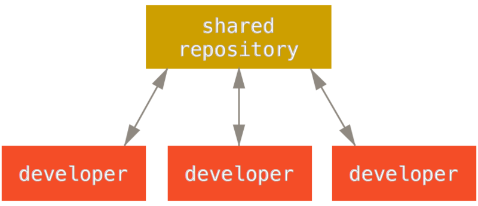

.. {{{  RST definitions

.. |br| raw:: html

    

.. |clear| raw:: html

    

.. role:: checkpoint
    :class: checkpoint

.. role:: keyterm
    :class: keyterm

.. role:: strike
    :class: strike

.. |home| image:: _static/icons/home.png
    :class: midline

.. |github| image:: _static/icons/github-circle.png
    :class: midline

.. |gplus| image:: _static/icons/google-plus.png
    :class: midline

.. }}}

.. {{{ Introduction
git
===
* |home| http://michel.albert.lu/shelf/git2015
* http://git-scm.com
* Images licensed under CC BY-NC-SA 3.0 by Scott Chacon
.. }}}

.. {{{ Outline of Version Control
What is Version Control
-----------------------

* Like "track changes" in office products. But on steroids.
* Primarily for plain-text files (f.ex.: source code).
* Visualising changes in files (diffing).
* Undo those changes easily.
* Branching, branching, branching.
* Conflict handling/resolution.

Version Control Models
----------------------

================== =======================
 Name               Model
================== =======================
 CVS                Client/Server
 SVN                Client/Server
 ClearCase          Client/Server
 Perforce           Client/Server
 TFVC (TFS)         Client/Server
 Visual SourceSafe  Client/Server
 Bazaar             Distributed
 Mercurial          Distributed
 git                Distributed
================== =======================

Distributed vs. Client/Server
-----------------------------

Centralised (Client/Server)
~~~~~~~~~~~~~~~~~~~~~~~~~~~

.. image:: _static/images/centralized.png
    :align: left
    :width: 380px

.. sidebar:: Summary

    * One place to apply access rights.
    * Single point of failure

Distributed
~~~~~~~~~~~

.. image:: _static/images/distributed.png
    :align: left
    :width: 380px

.. sidebar:: Summary

    * Supports larger teams (infinite scale).
    * Access control works like a "Web of Trust".
    * No connection to server required (working off-line).
    * Can support very complex workflows (f.ex.: code-review, "tenured"
    repositories, …).

Git
---

* Fully distributed
* Stream of snapshots instead of history of deltas.

  * Latest snapshot is kept in full, backwards deltas (after packing).

* Nearly all operations executed locally (no network overhead).
* Strong integrity (SHA1 hashes of snapshot content).

History of Deltas
-----------------

.. image:: _static/images/deltas.png

Snapshots
---------

.. image:: _static/images/snapshots.png

Installing
----------

* Linux
    .. code-block:: bash

        $ sudo yum install git
        $ sudo aptitude install git
* MacOS

  * Run XCode
  * Run ``git`` in a terminal

* Windows

  * Official client: http://git-scm.com/download/win
  * Github for Windows: http://windows.github.com
.. }}}

.. {{{ Key terms
Key Terms
---------

working copy
    The files you are working with, the files you see on your disk, your copy
    of the source-code.

index
    A "staging area" to prepare the next commit. As far as I know, unique to
    git.

commit
    A snapshot of the source code. These are points in time you can come back
    to.

repository
    This is where all the history (commits) and related metadata (tags,
    branches, …) are stored.
.. }}}

.. {{{ repo setups
Repository Setups
=================

One Reference Repo
------------------

.. nextslide::
    :increment:

* Very similar workflow to a centralised VCS. No new tricks to learn.
* Good for small teams.
* Easy to manage.
* Developers do not need to make their repositories public.

.. admonition:: Info

    "Public" here does not necessarily mean public to the world. It only means
    that someone else than the author has access to the repo!

    Note that instead of a public repository, git also makes it easy to
    contribute changes via e-mail.

Integration Manager
-------------------

.. image:: _static/images/integration-manager.png
    :align: center

.. nextslide::
    :increment:

* Mostly distributed.
* Integration manager has control over what patches (changes) are accepted.
* Good for projects with dynamic teams.
* Developers need to provide a public repository.

Beneveloent Dictator Model
--------------------------

.. image:: _static/images/benevolent-dictator.png
    :align: center

.. nextslide::
    :increment:

* Better control over contributed code.
* Essentially a Web of Trust (WoT).
* Good for very large projects with large teams.
* Used to manage the Linux source code.
* Developers need to provide a public repository.

.. }}}

.. {{{ Workflow
Example Workflow
----------------

.. figure:: _static/images/nvie-workflow.png
    :width: 400
    :align: center

    See: http://nvie.com/posts/a-successful-git-branching-model/

Version Numbers
---------------

* Semantic versioning (http://www.semver.org)
* Very good for application interfaces.
* More difficult for user interfaces.
* major, minor, patch

  * **major** backwards *incompatible* changes.
  * **minor** backwards compatible changes.
  * **patch** bugfixes.

Workflow Branches
-----------------

master
    One commit per release.

develop
    Ongoing work

release/*
    Feature freeze for release / metadata & doc updates

hotfix/*
    Bugfixes

feature/*
    Work on one specific feature.

.. }}}

Usage
=====

Help
----

.. code-block:: bash

    $ git help <verb>
    $ git <verb> --help
    $ man git-verb

git Areas
---------

.. image:: _static/images/areas.png
    :align: center

.. {{{ essential commands

Essential Commands (local)
--------------------------

``git init``
    Create an empty git repository or reinitialize an existing one

``git add``
    Add file contents to the index

``git status``
    Show the working tree status

``git commit``
    Creates a new snapshot from the index.

``git log``
    Shows the timeline of changes.

.. nextslide::
    :increment:

``git checkout``
    Gets a branch or path/file into the working directory.

``git gitk``
    Launches a graphical history browser.

``git show``
    Displays the content of any git object (commit, branch, tag, tree, …)

``git reset``
    Moves the ``HEAD`` pointer. Can be used (among other things) to drop all
    pending (non-committed) changes.

Essential Commands (remote)
---------------------------

``git clone``
    Clone a repository into a new directory. This is *not* the same as
    ``checkout`` in SVN!

``git pull``
    Fetches changes **from** a remote repository (f.ex. the server).

``git push``
    Sends changes **to** a remote repository (f.ex. the server).
.. }}}

.. {{{ intermediate git commands
Intermediate Commands
---------------------

``git merge``
    Integrates someone elses work or branch into your current working copy.

``git rebase``
    Attaches a branch to another commit (rewriting each commit!).

``git bisect``
    Runs a binary search to find a commit which introduced a bug

``git log -S<pattern>`` (pickaxe)
    Searches for commits which introduced a specific change.

.. nextslide::
    :increment:

``git cherry-pick``
    Takes a single commit (from any branch) and applies it to the current
    branch. The old commit still remains.

Example Remotte Interaction
---------------------------

.. image:: _static/images/small-team-flow.png
    :align: center
    :height: 500px
.. }}}

.. {{{ Branching
Branching
=========

Creating a new branch
---------------------

You can create branches in two ways:

* ``git branch <branch-name>``
  This will create the new branch without switching to it. It will have the
  current ``HEAD`` as parent.
* ``git checkout -b <branch-name>``
  This will create a new branch with the current ``HEAD`` as parent **and**
  switch to it.

The all branch operations are available under the ``git branch`` command. It
can also delete (``-d``) and rename (``-m``) branches.

Merging
-------

.. sidebar:: Fast-Forwards

    When the latest commit on a branch is the sole descendant of the
    branch-point, git does a so-called "fast-forward". In this case no new
    "merge-commit" object is created. Instead git simply moves the target
    branch pointer forwards.

When finished with a branch, you can simply switch to the target branch, and
merge your branch::

    git checkout master
    git merge feature-1

Conflicts
---------

.. sidebar:: Conflict Markers

    Conflicts in git are created similarly to other VCSs by inserting "markers"
    into the source code. For example::

        <<<<<<<
        This is your code
        =======
        This is someone elses code
        >>>>>>>

When the merged branches both contain changes to the same line, git pauses the
process for you to fix the conflict. You can inspect the paused situation using
``git status``. In this case you need to:

* Fix the conflicted files (manual or with ``git mergetool``)
* Add the files to the index.
* Run ``git commit``
.. }}}

.. {{{ Configuration
Configuration
-------------

* ``/etc/git``
* ``~/.gitconfig`` (or ``~/.config/git/config``)
* ``.git/config``

.. code-block:: ini
    :caption: Example ~/.gitconfig

    [user]
    name = John Doe
    email = john.doe@example.com

    [core]
    editor = vim

    [alias]
    st = status -s

.. nextslide::
    :increment:

core.editor
    Which editor to run for interactive prompts

commit.template
    The filename of a file which gets loaded by default into the commit
    message.

core.excludesfile
    Your personal, global excludes file. This should not contain
    project-specific values.

help.autocorrect
    Automatically correct minor misspellings in git commands (``git checkut``
    -> ``git checkout``)

.. nextslide::
    :increment:

merge.tool
    Which tool to use by default when running ``git mergetool``.

diff.tool
    Which tool to use by default when running ``git difftool``.

core.autocrlf
    How to handle CRLF issues (should be set to "true" on Windows).
.. }}}

.. {{{ hooks
Hooks (client-side)
-------------------
.. see page 402

* User runs ``git commit``
* ``pre-commit``
* ``prepare-commit-msg``
* User edits and saves the commit message
* ``commit-msg``
* Commit is finalized.
* ``post-commit``

Hooks (server-side)
-------------------
* User runs ``git push``
* git updates the remote references (locally).
* ``pre-receive``
* ``update``
* git finalizes the push
* ``post-receive`` (Cannot about push!)
.. }}}

.. {{{ Best practices
General Best Practices
----------------------

* Avoid publishing broken commits.
* Avoid changing the published history (``git commit --amend``, ``git rebase``,
  ``git reset``, …).
* Avoid pushing too often. As long as you have not pushed, it is okay to change
  history (see the previous point).
* Use the index to prepare coherent commits (``git add -p`` is your friend).
* Commit often. Avoid working for a week and commit all that work in one go.
  This avoids hairy conflicts.
.. }}}

.. protocols http, https, git, ssh
.. (un)tracked, unmodified, modified, staged
.. hands-on -> Create a new file, view status, add it to repo
..    !!! Never add derived files (binary, minified, ...)
.. hands-on -> modify exsting file, view status, add it to repo
.. hands-on -> modify the same file again, view status, add it to repo <-- listed as staged and modified
.. hands-on -> git status --short/-s
.. .gitignore
.. diff       Show changes between commits, commit and working tree, etc
..    --staged/--cached
..    --difftool
.. commit     Record changes to the repository
..    -v
..    -a
..    $EDITOR / core.editor
.. rm         Remove files from the working tree and from the index
..    --cached
.. mv         Move or rename a file, a directory, or a symlink
..    equivalent to remove -> add
.. log        Show commit logs
..    >> git clone https://github.com/schacon/simplegit-progit
..    Author vs. Committer
..    --since/--after, --until/--before
..    --author
..    --grep (--all-match)
..    -S
..    -L
..    <from>..<to>
.. == UNDOING ==
.. reset
.. commit --amend
.. checkout -- <filename>
.. == REMOTES ==
.. remote
..      -v
..      add <shortname> <url>
..      show <shortname>
.. fetch <shortname>     Download objects and refs from another repository
.. push/fetch/merge(basic)/pull
.. tag        Create, list, delete or verify a tag object signed with GPG
..      pushing tags
.. == WORKING WITH REMOTES ==
..      topic/feature branches
..      Everything is local! No server communication, no sharing!
..      Remote tracking branches
..      git fetch
..      git push (no branches created by default)!
..          <localname>:<remotename> (can be used for deleting)
..      git branch -vv
..      push origin --delete <targetbranch>
.. == REWRITING HISTORY ==
..      rebase     Forward-port local commits to the updated upstream head
..          -i
.. == ON THE SERVER ==
..      bare repositories
..      protocols
..          local
..          http(s), smart (1.6.6+)/dumb
..          ssh
..          git
..      git-shell in /etc/passwd
.. == WORKFLOWS ==
..      email-based
.. stash
.. == ADVANCED STUFF ==
..      manual merging

.. grep       Print lines matching a pattern
.. show       Show various types of objects
.. bisect     Find by binary search the change that introduced a bug

.. {{{ --- FIN ----------------------------------------------------------------
.. slide::
    :level: 2

    .. container:: centered

        Thank You!

        .. image:: _static/avatar.jpg
            :align: center
            :class: avatar

        Questions?

    * |home| http://michel.albert.lu
    * |github| exhuma
    * |gplus| MichelAlbert
.. }}}

.. vim: set foldmethod=marker :
