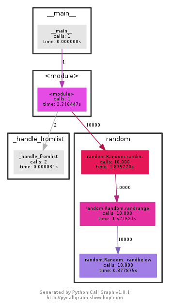

Debugging & Profiling
=====================

Code With Error
---------------

.. code-block:: python
    :class: smaller

    class MyClass:
        def __init__(self, a, b):
            self._a = a
            self._b = b

        def calc(self):
            return self._a + self._b

    def func_a(instance):
        print(instance.calc())

    def main():
        app = MyClass('a', 2)
        func_a(app)

    if __name__ == '__main__':
        main()

Post Mortem Debugging
---------------------

Running the above code with: ``python -m pdb foo.py``

.. code-block:: text
    :class: smaller
    :emphasize-lines: 1, 16-17

    python -m pdb foo.py
    > /tmp/foo.py(1)<module>()
    -> class MyClass:
    (Pdb) c
    Traceback (most recent call last):
      File "/usr/lib/python2.7/pdb.py", line 1314, in main
        pdb._runscript(mainpyfile)
      File "/usr/lib/python2.7/pdb.py", line 1233, in _runscript
        self.run(statement)
      File "/usr/lib/python2.7/bdb.py", line 400, in run
        exec cmd in globals, locals
      File "<string>", line 1, in <module>
      File "foo.py", line 1, in <module>
        class MyClass:
    [...]
    Uncaught exception. Entering post mortem debugging
    Running 'cont' or 'step' will restart the program
    > /tmp/foo.py(7)calc()
    -> return self._a + self._b
    (pdb)

.. nextslide::
    :increment:

Quick inspection:

``ll``
    print the code-listing of the current scope (only in Python 3)

``pp locals()``
    pretty-print all local variables

``pp vars(something)``
    pretty-print all variables defined on *something*

Hard Coded Breakpoint
---------------------

Aside from post-mortem debugging, it is possible to add a breakpoint via code::

    from pdb import set_trace
    set_trace()

* Very convenient!
* ``set_trace()`` will drop you in a  PDB shell right away.
* Never ever ever ever **ever** deploy that to production!
* Don't even think about adding this to the standard library code!

Soft Breakpoints
----------------

Instead of setting breakpoints via source-code, you can set them directly via
the debugger shell. Examples:

::

    (pdb) import logging
    (pdb) b logging.getLogger

::

    (pdb) pdb /usr/lib/python3.5/logging/__init__.py:1774

For a conditional break, add ``, <condition>`` to the line::

    (pdb) import logging
    (pdb) b logging.getLogger, name=='mylogger'

Interactive Debugger Commands
-----------------------------

``? [command]``
    List all commands, or show help of one command.

``n``
    Move to next line

``s``
    Step into function

``b``
    Set a new breakpoint

``c``
    Continue (up the the next breakpoint).

``l`` and ``ll``
    Show code listing

.. nextslide::
    :increment:

.. code-block:: text

    Documented commands (type help <topic>):
    ========================================

    EOF    c          d        h         list      q        rv       undisplay
    a      cl         debug    help      ll        quit     s        unt
    alias  clear      disable  ignore    longlist  r        source   until
    args   commands   display  interact  n         restart  step     up
    b      condition  down     j         next      return   tbreak   w
    break  cont       enable   jump      p         retval   u        whatis
    bt     continue   exit     l         pp        run      unalias  where

.. rst-class:: smaller-slide

Exercise: Debugging the Standard Library
----------------------------------------

* Write a script that makes use of *any* standard library module. Some examples:

  * :py:mod:`ipaddress`
  * :py:mod:`logging`
  * :py:mod:`os`

* Run the script with ``-m pdb``
* Manually set a breakpoint to the function you are using.
* Run the script with ``c``
* Once the breakpoint is hit, experiment with ``where``, ``up``, ``down``,
  ``ll`` and ``pp``.

Alternative Debuggers: ipdb
---------------------------

.. figure:: _static/ipdb.png

.. nextslide::
    :increment:

* Very very similar to ``pdb``
* with additional features provided by the iPython shell.
* Syntax Highlighting

Alternative Debuggers: pudb
---------------------------

.. figure:: _static/pudb.png

.. nextslide::
    :increment:

* Console-based GUI
* Drop-In replacement for pdb
* Syntax Highlighting

Alternative Debuggers: WinPDB
-----------------------------

.. figure:: _static/winpdb.png
    :height: 400

.. nextslide::
    :increment:

* Graphical UI
* Supports remote debugging

   * Run a process using ``rpdb`` on the remote host
   * Run ``winpdb`` and attach to the remote host

Wiki-Page About Debugging
-------------------------

https://wiki.python.org/moin/PythonDebuggingTools

.. TODO * The code of the Standard Library

Profiling
---------

Profiling lets you find bottle-necks in your code. If something is running too
slow you may want to run a profiler.

Example Script for Profiling
~~~~~~~~~~~~~~~~~~~~~~~~~~~~

.. code-block:: python

    import logging
    from random import randint

    def foo():
        for i in range(1000):
            if i % 2 == 0:
                print(randint(0, i))
            logging.debug('Hello %r', i)

    if __name__ == '__main__':
        foo()

cProfile
--------

* Included in the standard library.
* Easy to use for simple profiling.

Simple use-case::

    $ python -m cProfile -s cumtime script.py

.. hint::

    It's often worthwile to write a small ``script.py`` file which runs the
    code you want to profile. This makes it easy to run using ``-m cProfile``

cProfile Output
---------------

.. code-block:: text
    :class: smaller

             1610 function calls (1586 primitive calls) in 0.450 seconds

       Ordered by: standard name

       ncalls  tottime  percall  cumtime  percall filename:lineno(function)
            6    0.000    0.000    0.000    0.000 <frozen importlib._bootstrap>:119(release)
            6    0.000    0.000    0.000    0.000 <frozen importlib._bootstrap>:159(__init__)
            6    0.000    0.000    0.000    0.000 <frozen importlib._bootstrap>:163(__enter__)
            6    0.000    0.000    0.000    0.000 <frozen importlib._bootstrap>:170(__exit__)
            6    0.000    0.000    0.000    0.000 <frozen importlib._bootstrap>:176(_get_module_lock)
            6    0.000    0.000    0.000    0.000 <frozen importlib._bootstrap>:190(cb)
          6/1    0.000    0.000    0.006    0.006 <frozen importlib._bootstrap>:214(_call_with_frames_removed)
            3    0.000    0.000    0.000    0.000 <frozen importlib._bootstrap>:225(_verbose_message)
            1    0.000    0.000    0.000    0.000 <frozen importlib._bootstrap>:235(_requires_builtin_wrapper)
            3    0.000    0.000    0.000    0.000 <frozen importlib._bootstrap>:310(__init__)

.. nextslide::
    :increment:

**ncalls**
    for the number of calls,
**tottime**
    for the total time spent in the given function (and excluding time made in
    calls to sub-functions)
**percall**
    is the quotient of tottime divided by ncalls
**cumtime**
    is the cumulative time spent in this and all subfunctions (from invocation
    till exit). This figure is accurate even for recursive functions.

.. nextslide::
    :increment:

**percall**
    is the quotient of cumtime divided by primitive calls
**filename:lineno(function)**
    provides the respective data of each function

cProfile CLI Arguments
----------------------

Full synopsis::

    python -m cProfile [-o output_file] [-s sort_order] myscript.py

**output_file**
    Saves the statistics to a filename which can then be analyzed (manually)
    using :py:mod:`pstats`

**sort_order**
    Field by which to sort the results. See :py:meth:`pstats.Stats.sort_stats`
    for a list of avaibalbe names.

Profiling with pycallgraph
--------------------------

    pycallgraph & graphviz

``pycallgraph`` is a third-party module which is able to generate call-graphs
using ``graphviz`` (you ned to have it installed). It can also create output
for a tool called ``gephi``. Example call::

    pycallgraph -i "random.*" \
        graphviz -- foo.py

.. nextslide::
    :increment:

* *Huge* overhead!

  * When profiling try to elimilnate as much as unneccessary code as possible.

* Nodes colorised by time they took to complete. Red/Violet nodes = bottlenecks.
* Eliminate graph nodes by using ``--include`` and ``--exclude``.
