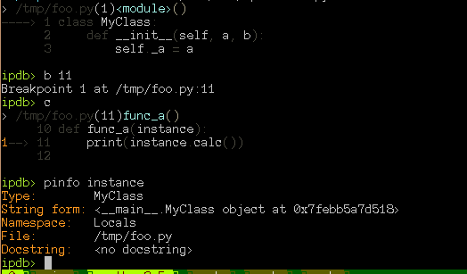
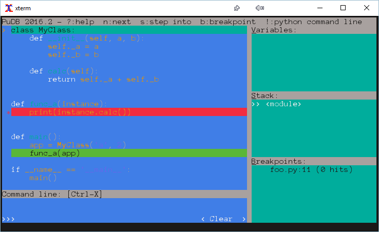
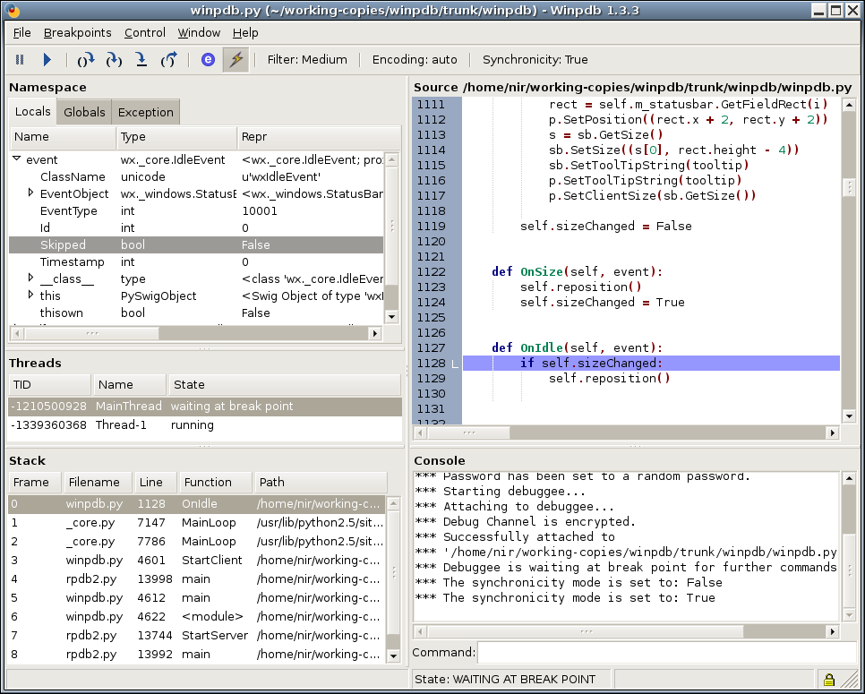

Debugging
=========

Code With Error
---------------

.. code-block:: python
    :class: smaller

    class MyClass:
        def __init__(self, a, b):
            self._a = a
            self._b = b

        def calc(self):
            return self._a + self._b

    def func_a(instance):
        print(instance.calc())

    def main():
        app = MyClass('a', 2)
        func_a(app)

    if __name__ == '__main__':
        main()

Stack Traces
------------

.. code-block:: python

    Traceback (most recent call last):
      File "foo.py", line 19, in <module>
        main()
      File "foo.py", line 16, in main
        func_a(app)
      File "foo.py", line 11, in func_a
        print(instance.calc())
      File "foo.py", line 7, in calc
        return self._a + self._b
    TypeError: Can't convert 'int' object to str implicitly

Post Mortem Debugging
---------------------

.. code-block:: text
    :class: smaller
    :emphasize-lines: 1, 16-17

    python -m pdb foo.py
    > /tmp/foo.py(1)<module>()
    -> class MyClass:
    (Pdb) c
    Traceback (most recent call last):
      File "/usr/lib/python2.7/pdb.py", line 1314, in main
        pdb._runscript(mainpyfile)
      File "/usr/lib/python2.7/pdb.py", line 1233, in _runscript
        self.run(statement)
      File "/usr/lib/python2.7/bdb.py", line 400, in run
        exec cmd in globals, locals
      File "<string>", line 1, in <module>
      File "foo.py", line 1, in <module>
        class MyClass:
    [...]
    Uncaught exception. Entering post mortem debugging
    Running 'cont' or 'step' will restart the program
    > /tmp/foo.py(7)calc()
    -> return self._a + self._b
    (pdb)

Hard Coded Breakpoint
---------------------

Aside from post-mortem debugging, it is possible to add a breakpoint via code::

    from pdb import set_trace
    set_trace()

* Very convenient!
* ``set_trace()`` will drop you in a  PDB shell right away.
* Never ever ever ever **ever** deploy that to production!
* Don't even think about adding this to the standard library code!

Soft Breakpoints
----------------

Instead of setting breakpoints via source-code, you can set them directly via
the debugger shell. Examples:

::

    (pdb) import logging
    (pdb) b logging.getLogger

::

    (pdb) pdb /usr/lib/python3.5/logging/__init__.py:1774

For a conditional break, add ``, <condition>`` to the line::

    (pdb) import logging
    (pdb) b logging.getLogger, name=='mylogger'

Interactive Debugger Commands
-----------------------------

``? [command]``
    List all commands, or show help of one command.

``n``
    Move to next line

``s``
    Step into function

``b``
    Set a new breakpoint

``c``
    Continue (up the the next breakpoint).

``l`` and ``ll``
    Show code listing

.. nextslide::
    :increment:

.. code-block:: text

    Documented commands (type help <topic>):
    ========================================

    EOF    c          d        h         list      q        rv       undisplay
    a      cl         debug    help      ll        quit     s        unt
    alias  clear      disable  ignore    longlist  r        source   until
    args   commands   display  interact  n         restart  step     up
    b      condition  down     j         next      return   tbreak   w
    break  cont       enable   jump      p         retval   u        whatis
    bt     continue   exit     l         pp        run      unalias  where

Alternative Debuggers: ipdb
---------------------------

.. nextslide::
    :increment:

* Very very similar to ``pdb``
* with additional features provided by the iPython shell.
* Syntax Highlighting

Alternative Debuggers: pudb
---------------------------

.. nextslide::
    :increment:

* Console-based GUI
* Drop-In replacement for pdb
* Syntax Highlighting

Alternative Debuggers: WinPDB
-----------------------------

.. nextslide::
    :increment:

* Graphical UI
* Supports remote debugging

   * Run a process using ``rpdb`` on the remote host
   * Run ``winpdb`` and attach to the remote host

Wiki-Page About Debugging
-------------------------

https://wiki.python.org/moin/PythonDebuggingTools

.. TODO * The code of the Standard Library
