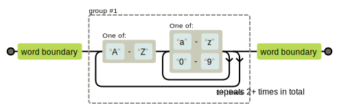

.. include:: ../common/rst_defs.rst

.. |br| raw:: html

    

.. |clear| raw:: html

    

.. role:: checkpoint
    :class: checkpoint

.. role:: keyterm
    :class: keyterm

.. role:: strike
    :class: strike

Python
======

.. code-block:: python

    print("Hello World")

About This Course
-----------------

.. ifnotslides::

    .. note::
        This document has been generated from the original slide sources. Some
        sections may seem so to be kept extensively short. This was necessary
        to make the slides readable. The same goes for code samples that have
        been cut into pieces. In that case, each block has a "filename" caption
        to give some context.

* Introduction to Python
    * The REPL
    * Python compared to other Languages
    * Standard Data Types & Typing
* Wiki
    * List pages.
    * Load & display a page.
    * Save a page (create or update).
    * Replace WikiWords with links.
* Packaging

.. include:: ../common/introduction.rst

Topics
------

.. ifslides::

   See the HTML version of this document

.. ifnotslides::

   Topics - Basic
   ~~~~~~~~~~~~~~

   ..                                         code example ┐
   ..                                 Documentation ┐      │
   ..     (*) esntl, (**) basic, (***) adv. ┐       │      │
   ..                                       │       │      │
   ..                                       │       │      │
   ..                                       │       │      │

   +-----------------------------------+-------+------+---------+
   | Description                       | Level | Docs | Example |
   +===================================+=======+======+=========+
   | data types -> Boolean, String     | ★☆☆   |      |         |
   | (&literals), Bytes, Numbers,      |       |      |         |
   | Lists, Tuples, Dictionaries,      |       |      |         |
   | Sets, ``None``                    |       |      |         |
   +-----------------------------------+-------+------+---------+
   | Looping                           | ★☆☆   | ✓    | ✓       |
   +-----------------------------------+-------+------+---------+
   | Falsy values                      | ★☆☆   |      |         |
   +-----------------------------------+-------+------+---------+
   | defining functions                | ★☆☆   | ✓    | ✓       |
   +-----------------------------------+-------+------+---------+
   | defining classes                  | ★☆☆   |      |         |
   +-----------------------------------+-------+------+---------+
   | ``in`` operator                   | ★☆☆   |      |         |
   +-----------------------------------+-------+------+---------+
   | String formatting                 | ★☆☆   |      |         |
   +-----------------------------------+-------+------+---------+
   | Variable Unpacking                | ★★☆   |      |         |
   +-----------------------------------+-------+------+---------+
   | imports                           | ★☆☆   | ✓    | ✓       |
   +-----------------------------------+-------+------+---------+
   | raising and catching exceptions   | ★☆☆   |      |         |
   +-----------------------------------+-------+------+---------+
   | Essential modules: os, sys, ...   | ★★☆   |      |         |
   | (sys.stderr, out, in)             |       |      |         |
   +-----------------------------------+-------+------+---------+
   | comprehensions (list, set & dict) | ★★☆   |      |         |
   | , generator expressions           |       |      |         |
   +-----------------------------------+-------+------+---------+
   | Slicing                           | ★☆☆   |      |         |
   +-----------------------------------+-------+------+---------+
   | Docstrings                        | ★☆☆   |      |         |
   +-----------------------------------+-------+------+---------+

.. ifnotslides::

   Topics - Advanced
   ~~~~~~~~~~~~~~~~~

   ..                                         code example ┐
   ..                                 Documentation ┐      │
   ..     (*) esntl, (**) basic, (***) adv. ┐       │      │
   ..                                       │       │      │
   ..                                       │       │      │
   ..                                       │       │      │

   +-----------------------------------+-------+------+---------+
   | Description                       | Level | Docs | Example |
   +===================================+=======+======+=========+
   | ``*args, *, **kwargs``            | ★★☆   | ✓    | ✓       |
   +-----------------------------------+-------+------+---------+
   | decorators                        | ★★★   | ✓    | ✓       |
   +-----------------------------------+-------+------+---------+
   | "magic" Variables and attributes  | ★★☆   | ✓    | ✓       |
   +-----------------------------------+-------+------+---------+
   | logging                           | ★★☆   | ✓    | ✓       |
   +-----------------------------------+-------+------+---------+
   | unit tests                        | ★★☆   | ✓    | ✓       |
   +-----------------------------------+-------+------+---------+
   | lambda                            | ★★★   | ✓    | ✓       |
   +-----------------------------------+-------+------+---------+
   | Class Customisation               | ★★☆   | ✓    | ✓       |
   +-----------------------------------+-------+------+---------+
   | raise from                        | ★★☆   |      |         |
   +-----------------------------------+-------+------+---------+

.. ifnotslides::

   Topics - Not Covered
   ~~~~~~~~~~~~~~~~~~~~

   ..                                         code example ┐
   ..                                 Documentation ┐      │
   ..     (*) esntl, (**) basic, (***) adv. ┐       │      │
   ..                                       │       │      │
   ..                                       │       │      │
   ..                                       │       │      │

   +-----------------------------------+-------+------+---------+
   | Description                       | Level | Docs | Example |
   +===================================+=======+======+=========+
   | DBAPI2                            | ★★☆   |      |         |
   +-----------------------------------+-------+------+---------+
   | Packaging                         | ★★☆   |      |         |
   +-----------------------------------+-------+------+---------+
   | everything is an object a         | ★★☆   |      |         |
   | (f.ex.: ``__doc__`` of function)  |       |      |         |
   +-----------------------------------+-------+------+---------+
   | ReST                              | ★☆☆   |      |         |
   +-----------------------------------+-------+------+---------+
   | ABCs (Abstract Base Classes)      | ★★☆   |      |         |
   +-----------------------------------+-------+------+---------+
   | PEPs                              | ★☆☆   |      |         |
   +-----------------------------------+-------+------+---------+
   | Regular Expressions               | ★☆☆   |      |         |
   +-----------------------------------+-------+------+---------+
   | with statement (context managers) | ★☆☆   |      |         |
   +-----------------------------------+-------+------+---------+
   | sorting lists                     | ★☆☆   |      |         |
   +-----------------------------------+-------+------+---------+
   | iterators and generators          | ★★★   |      |         |
   +-----------------------------------+-------+------+---------+

Installation
============

* Linux
* Windows
* MacOS
* Go to https://www.python.org/downloads

Linux
-----

* Available by default on most Unix platforms.
* Packaged default may either be Python 2 (Debian, Red-Hat, Ubuntu < 16.04), or
  Python 3 (Arch, Ubuntu ≥ 16.04).
* Python 2 and 3 can both happily live on the same system without interfering
  with each other (f.ex. the ``python`` and ``python3`` packages on debian and
  derivates).

.. note::

    For this course we will use ``Python-3.5.1.tgz``.

    In order to successfully compile with all features for this course, you
    need the required libraries and system packages. For debian derivates these
    packages are:

    * ``build-essential``
    * ``libsqlite3-dev``

    Once the requirements are available run::

        ./configure --prefix=/opt/python3.5
        make
        sudo make install

Mac OS X
--------

* Download the ``pkg`` file and install.

.. tip::

    By default, Python 2.7 is installed. Installing from the official package
    will *not* overwrite the existing installation. They will live
    side-by-side.

Windows
-------

* Download the ``python-3.5.x.msi`` file and install.

Introduction
============

* High-level overview of the language.
* Implementations
* Editors
* Language features

Code examples in these slides
-----------------------------

There are 3 ways, this course shows code examples:

* Examples from the Python REPL. These are marked with leading ``>>>``
  characters which is the default REPL promp.
* Blocks with filename header. These are meant to be in the filename seen in
  the header. The filename is always relative to the project folder.
* Blocks without filename header. These are "throwaway" examples which can be
  saved anywhere. Or run directly in the REPL.

Birds-Eye View
--------------

* Runs on all major platforms.
* JIT Compiled (into bytecode).
* Large community.
* #3 on `TIOBE Index <http://www.tiobe.com/tiobe_index>`_
  (After Java at #1 and C on #2). Based on result of December 2018.
* Strict Syntax (indentation matters)!
* *Large* Standard Library ("Batteries Included").
* Global Interpreter Lock (the GIL)
* Slow

Implementations
---------------

* **CPython** (the default - *recommended*, ≠ cython).
* Jython (runs in Java VM).
* IronPython (runs in dotNET CLR).
* PyPy (faster).
* Stackless (microthreads).
* …

.. note::

   "CPython" is recommended because it implements everything in the official
   documentation. Other implementations may be incomplete, but may still be
   useful if there are special requirements.

Editors
-------

* PyCharm — https://www.jetbrains.com/pycharm/
* IDLE
* Komodo IDE — http://komodoide.com/
* Eclipse (with PyDev) — https://eclipse.org
* Netbeans (with Python plugin) — https://netbeans.org
* Any text-editor
    * vim
    * emacs
    * notepad++
    * sublime
    * …

Hello World!
------------

* Open PyCharm
* Create a new Project in PyCharm

.. code-block:: python
    :caption: **Filename:** hello.py

    print('Hello World!')

* Save this to a file called ``hello.py``
* Run the code example.

Simple Operations
-----------------

.. code-block:: python
    :caption: **Filename:** hello.py

    print('Hello ' + 'World!')
    print(10 + 3)
    print(10 / 3)

Variables
---------

.. code-block:: python
    :caption: **Filename:** hello.py

    a = 'Hello'
    b = 'World!'
    print(a + b)

    a = 10
    b = 3
    print(a * b)

Duck Typing
-----------

    When I see a bird that walks like a duck and swims like a duck and quacks
    like a duck, I call that bird a duck.

    -- James Whitcomb Riley

.. rst-class:: smallest-slide

Typing Comparison
-----------------

+--------------+-----------+---------------------+
| Language     | Typing    | Coercion Strictness |
+==============+===========+=====================+
| Java         | Static    | Very strict         |
+--------------+           +                     +
| C#           |           |                     |
+--------------+           +---------------------+
| C++          |           | Fairly strict       |
+--------------+-----------+                     +
| Python       | Dynamic   |                     |
+--------------+           +                     +
| Ruby         |           |                     |
+--------------+           +---------------------+
| C            |           | Less strict         |
+--------------+           +---------------------+
| PHP          |           | Not strict          |
+--------------+           +                     +
| JavaScript   |           |                     |
+--------------+-----------+---------------------+

.. note:: Explore

    Go to http://repl.it/ and try to execute ``20 + "22"`` in some languages.
    What are the results? What does this tell you?

    Make sure to test Python, PHP and JavaScript. They have a very simple REPL
    and show a good example of coercion problems that may arise.

.. admonition:: Definition

    Coercion
        Implicit Type Conversion.

    ``20 + "22" -> ?``

Python 2 vs Python 3
--------------------

.. sidebar:: Python 3.5

    This course is based on **Python 3.5** as it comes bundled with ``pip`` and
    ``pyvenv``.

* Start at Python 3.3+ (current version is 3.7).
* Improved Unicode support. (bytes ≠ text, developer in full control).
* Iterators everywhere (:py:func:`map`, :py:func:`filter`, |ell|).
* No new features are added to Python 2 (f.ex.: :py:mod:`asyncio`, but
  backports exist).
* *BUT:* Legacy platforms may only support Python 2.

.. note::
    Python 3.3 reintroduced unicode strings (strings with a ``u`` prefix). This
    prefix was removed in 3.0 and made porting very difficult.

Python 2 - End of Life: 2020
~~~~~~~~~~~~~~~~~~~~~~~~~~~~

**Update NOW**

Strings & Bytes in Python 2 & 3
~~~~~~~~~~~~~~~~~~~~~~~~~~~~~~~

====================  ==========  ==========
 Literal               Py2 Type    Py3 Type
====================  ==========  ==========
 ``'Hello World'``     bytes       unicode
 ``u'Hello World'``    unicode     unicode
 ``b'Hello World'``    bytes       bytes
====================  ==========  ==========

.. warning::

    * *Always* prefix text with ``u`` in **Python 2**. *Unless* you know
      *exactly* that you want bytes!
    * *Never* use ``encode`` on bytes.
    * *Never* use ``decode`` on strings.

.. note::

    Technically, the type of ``''`` is ``str`` in Python2. However, in Python2,
    ``str`` and ``bytes`` are equivalent. Try running ``id(str)``,
    and ``id(bytes)`` in both Python2 and Python3.

The Python Shell (REPL)
-----------------------

* read-eval-print loop.
* Interactive shell.
* Extremely helpful tool to test out ideas, play with code before implementing
  it.

Simply run ``python3`` on the console to start it.

By convention, lines with ``>>>`` represent a REPL prompt.

.. code-block:: python

    >>> 1 + 1
    2

    >>> print("Hello World!")
    Hello World!

Getting Help
------------

* On the web: http://docs.python.org
* Type ``help()`` in the REPL. This can be used on any object::

    >>> myvar = 1
    >>> help(myvar)  # This will open the help for "ints"

* Type ``pydoc`` in the shell.

  * Like man-pages for Python. Example: ``pydoc str``
  * Same as ``help()`` in the REPL.
  * Use ``pydoc -b`` (``python -m pydoc -b`` on Windows) to run a local
    web-server on a random port. This is useful if you have no internet
    connection.

Diving in
=========

.. rst-class:: smaller-slide

Basics
------

* The variable type is implicit, but strong (dynamic typing)
* Variables are assigned with the ``=`` operator
* Line-comments start with a ``#`` character. Block comments don't exist.
* Lines do **not** need to end with a semicolon (``;``)
* Blocks are defined by indentation. The line starting a block ends with a
  colon (``:``).

.. literalinclude:: ../code/basics/app.py
   :caption: basics/app.py

.. note::

   * Once a variable is assigned a type, the type of that variable can no
     longer change. But the same name can later refer to a new object.
   * Common practice for indentation is to use 4 spaces. See :pep:`8` for more
     details on code-style.
   * The condition in the ``if`` statement is by convention not surrounded by
     parentheses (See :pep:`8`).

Working with Files
------------------

* :py:func:`open` is used to access files on the disk (for reading and
  writing).
* By default files are opened as "text".
* Using a ``for`` loop on file objects will iterate line-by-line.
* :py:mod:`pathlib` and :py:mod:`os.path` contain useful functions for working
  with files.

.. literalinclude:: ../code/working-with-files/app.py
   :caption: working-with-files/app.py

Looping
-------

.. literalinclude:: ../code/loops/app.py
   :caption: loops/app.py

Reading Files
-------------

.. literalinclude:: ../code/csv1/app.py
   :caption: csv1/app.py

Organising Code - Functions
---------------------------

* Functions are introduced using the ``def`` keyword
* A function *always* returns a value in Python. If no ``return`` statement is
  present, the return-value will be ``None``.

.. nextslide::
   :increment:

.. literalinclude:: ../code/functions/app.py
   :caption: functions/app.py

Organising Code - Modules
-------------------------

* Every Python file can be called a "module" and can be imported in other
  Python scripts.
* The code inside a module is executed on first import.

  * They *should* not "run" anything outside of classes & functions.
  * They *should* contain definitions only (functions, classes, variables, …)

.. note::

   Any code that is written outside a function or class (at the top-level) of a
   module is executed when that module is *first* imported. This can be
   intentional if you want to ensure that a certain piece of code is excuted
   only once in an application. But it can also lead to unexpected
   side-effects and makes testing harder.

   Some advanced use-cases can make use of such code for "metaprogramming".

   As a rule of thumb: Don't put *business logic* on the top-level of a module.

.. nextslide::
   :increment:

.. literalinclude:: ../code/modules/util.py
   :caption: modules/util.py

.. nextslide::
    :increment:

.. literalinclude:: ../code/modules/app.py
   :caption: modules/app.py

.. nextslide::
    :increment:

* Importing will cause ``.pyc`` files to be created (inside the ``__pycache__``
  folder).
* Imports are cached. The code inside a module is only interpreted on first
  import.
* Therefore, modules can be abused as global variable storage & singletons
  (with all the risks this implies).

.. rst-class:: small-slide

Organising Code - Packages
--------------------------

* Use packages to organise your project into sub-folders.
* A ``__init__.py`` file marks a folder as package (can be empty).
* The term "package" is ambiguous in Python. It can mean:

  * A third-party *package* you get from the Internet or write yourself (in
    other words: a "library").
  * Any folder with ``.py`` files and a ``__init__.py`` file.

.. code-block:: python

    myproject
    ├── myapp.py
    ├── subpackage1
    │   ├── __init__.py
    │   └── util.py
    └── subpackage2
        ├── __init__.py
        ├── evendeeper
        │   ├── __init__.py
        │   └── dbmodel.py
        └── util.py

.. nextslide::
   :increment:

* Relative vs Absolute imports. See :pep:`328`::

      # Files:
      #
      #    mypackage
      #    ├── __init__.py    <--- Marks folder as package
      #    ├── localmodule.py
      #    └── app.py         <--- code below is in this file

      # Relative import (recommended, but only works in packages)
      from .localmodule import func

      # Absolute import (recommended, but only works in packages)
      from mypackage.localmodule import func

      # Ambiguous import (not recommended)
      from localmodule import func

.. rst-class:: smaller-slide

Exercise
--------

* In a file ``util.py`` write a function ``read_file`` which:

  * Takes two arguments: A **filename** and a **separator**
  * Reads the file line-by line, splits each line using the given *separator* 
  * It should return a list where each element is another list with only the
    first and second column of the input file

* Write a second file ``app.py``:

  * This file should import ``util.py`` ...
  * ... and call ``read_file`` with an appropriate file-name and separator.
  * Loop over the return value of ``read_file`` and print the row.

The Standard Library
--------------------

Python comes with "batteries included".

The standard library of Python comes with *many* useful features. This makes it
possible to write many useful applications without third-party (external)
libraries.

* Standard Library modules are also imported using the ``import`` statement.
* Standard Library modules take precedence in imports (Use relative imports on
  name-conflicts). See :pep:`328`.

Using the ``csv`` module
------------------------

The :py:mod:`csv` module makes it easy to read delimited data. It also deals
with:

* quoted values
* multiline values
* escaped characters

Let's use this for our example:

.. literalinclude:: ../code/csv2/app.py
   :caption: csv2/app.py

Basic Data Types
----------------

See https://docs.python.org/3/library/stdtypes.html

None (NULL)
~~~~~~~~~~~

* Default return value of functions
* Is seen as "false" in a boolean context
* Immutable
* Special instance of the :py:class:`NoneType` class.
* Singleton.

.. code-block:: python

   myvariable = None

.. rst-class:: smaller-slide
Strings
~~~~~~~

* Instances of class :py:class:`str`.
* Delimited by one of ``'``, ``"``, ``'''``, ``"""``
* Unicode objects, sequence of unicode code-points (in Python3).
* Many useful methods

  * :py:meth:`str.split`, :py:meth:`str.partition`, :py:meth:`str.strip`
  * :py:meth:`str.startswith`
  * :py:meth:`str.encode`
  * :py:meth:`str.find`
  * :py:meth:`str.isnumeric`
  * …

.. code-block:: python

   mystring = 'Hello World!'

.. rst-class:: smaller-slide
.. nextslide::
   :increment:

String Literals

* Simple Quotes (``'`` and ``"``)
* Triple Quotes / Multiline Strings (``'''`` and ``"""``)
* String-Liteal Prefixes

  * ``r`` raw-string: All backslash-escapes are ignored. Useful for regular
    expressions.
  * ``f`` format-string: Allows embedding of variables
  * ``u`` unicode (Backwards compatibility for Python 2)

.. code-block:: python

   mytext = u"Hello World!"
   unescaped = r"This does *not* \n contain a new-line!"
   formatted = f'The variable "mytext" contains the value {mytext}'

.. rst-class:: smaller-slide
.. nextslide::
   :increment:

* Supports different string-formatting styles:

  * "printf"-style formatting: ``"Hello %20s %s" % (a, b)``
  * Formatting "mini-language": ``"Hello {} {}".format(a, b)``
  * f-Strings: ``f"Hello {a} {b}"``

See `RealPython <https://realpython.com/python-string-formatting/>`_,
`printf-style formatting
<https://docs.python.org/3/library/stdtypes.html#old-string-formatting>`_ and
`format-language <https://docs.python.org/3/library/string.html>`_ for more
information.

More on this later …

.. rst-class:: small-slide

Numbers
~~~~~~~

* Builtin types: :py:class:`int` and :py:class:`float`
* No difference between "long" and "short" integers (handled internally by
  Python). There is also no "double precision" type.
* Support for precise decimal operations (:py:mod:`fractions`,
  :py:mod:`decimal`).
* Noteworthy modules: :py:mod:`statistics`, :py:mod:`math` and :py:mod:`cmath`.

.. code-block:: python

   myint = 1               # type: int
   bin_notation = 0b10101  # type: int, value: 21
   hex_notation = 0xc0ffee # type: int, value: 12648430
   octal_notation = 0o10   # type: int, value: 8

   myfloat = 3.5           # type: float
   myfloat2 = .3           # type: float
   sci_notation = 1.3E5    # type: float, value: 130000.0

Boolean
~~~~~~~

* Two reserved words: ``True`` and ``False``. They are object instances,
  subclasses of ``int``.

.. code-block:: python

   my_boolean_a = True
   my_boolean_b = False

.. rst-class:: smaller-slide
Lists
~~~~~

* Surrounded by square brackets::

   mylist = [1, 2, 3, 'hello', 5, 6, True]

* Very similar to arrays in other languages. Real arrays are in the
  :py:mod:`array` module.
* Heterogenuous
* Indexable from both left (``mylist[3]``) and right (``mylist[-3]``).
* Slicing: ``mylist[3:7]``
* Mutable::

    mylist[2] = new_value
    mylist.append(10)

.. note::

   When accessing a slice, the first index is *inclusive* and the second index
   is *exclusive*. For example::

      >>> mylist = ['a', 'b', 'c', 'd', 'e']
      >>> mylist[1:3]
      ['b', 'c']

Exceptions
----------

* Exceptions are Python's error-handling mechanism.
* They can be triggered internally by Python, or manually by self-written code.
* They can be caught/handled using a ``try/except`` block.
* Unhandled exceptions will crash the application.

An example exception:

.. code-block:: python

    >>> from example_exception import foo
    >>> foo()
    Traceback (most recent call last):
      File "<stdin>", line 1, in <module>
      File "/path/example_exception.py", line 3, in foo
        return a['z']
    KeyError: 'z'

.. note::

    From bottom to top:

    **KeyError**
        The kind of the exception which was thrown.

    ``return a['z']``
        The line which caused the error.

    **File "..."**
        The finlename that caused the error.

    **line 3**
        The line in the file.

    **in foo**
        The function-name in which the error was thrown.

    Moving up the "stack", the lines have the same format. The further you move
    "up", the closer you get to the entry-point of the application.

.. nextslide::
   :increment:

* By default, Python will raise an exception of one of the `builtin types
  <https://docs.python.org/3/library/exceptions.html#exception-hierarchy>`_.
* You can create your own exceptions by subclassing.
* Raising (triggering/throwing) exceptions is done using the ``raise``
  keyword::

      class MyException(Exception):
         pass

      if user_input > 4096:
         raise ValueError('user_input must be smaller than 4096')
      raise MyException('Hello World!')

.. nextslide::
   :increment:

* If not handled, exceptions will crash the application and print a traceback
  on ``stderr``.
* They can be handled using a ``try/except`` block:

.. code-block:: python

   from example_exception import foo

   try:
      foo()
   except KeyError as the_exception:
      # Something bad happened :(
      print(the_exception)

.. rst-class:: smaller
.. tip::

   Always log the traceback of an exception using either
   ``logging.debug(the_exception, exc_info=True)`` or
   ``logging.exception('Simple description')``

.. rst-class:: small-slide
Exercise - Simple Data Types & StdLib
-------------------------------------

Write a new function *read_data* that takes a filename as argument and does the
following:

* Open the file with the given filename
* Initialise a new variable named ``output`` as empty list.
* Create a CSV reader with the opened file object
* Loop through each line and do the following:

  * Convert each numerical column into an appropriate type (f.ex.: use
    :py:class:`decimal.Decimal` for monetary values).
  * Split the 7 :sup:`th` column (index 6) into a list of strings.
  * **(optional)** Add a new column at the end which contains the ``MD5``
    hex-digest of the whole line (see :py:func:`hashlib.md5`).

    * MD5 sums can only be calculated on bytes (not strings)

  * Any conversion error should be printed out, avoiding crashes.
  * Append the new columns to the ``output`` list

* After the loop, return the list ``output``

Variable Unpacking
------------------

Python can assign more than one value in one statement:

.. code-block:: python

   # Assign 13 to variable_a, and 'Hello' to variable_b
   variable_a, variable_b = 13, 'Hello'

This work in every place where values are assigned:

.. code-block:: python
   :emphasize-lines: 8

   mylist = [
      [1, 2],
      [11, 22]
   ]

   # Each item in the list is another list of two elements each.
   # They can be "unpacked" directly in the loop.
   for variable_a, variable_b in mylist:
      print(variable_a, variable_b)

Enumerating Loops (access the current loop index)
-------------------------------------------------

Keeping a reference to the current iteration number is easy by using the
:py:func:`enumerate` function.

In combination with *variable unpacking* loops can be written as:

.. code-block:: python

   for i, item in enumerate(mylist):
      print('Item at index %d is: %r' % (i, item))

.. tip::

   Python makes it relatively easy to avoid accessing items by index.
   Enumerating lists like this only needed in rare cases (calculating progress,
   logging the current line during text-file processing, …).

Basic Data Types (continued)
----------------------------

Also on https://docs.python.org/3/library/stdtypes.html

Bytes
~~~~~

* Builtin type: :py:class:`bytes`.
* byte-literals look just like strings, but with a ``b`` prefix::

   b"Hello World"

* Immutable (for byte-operations see :py:class:`bytearray`).
* Almost identical API to strings. The key differences are:

  * Bytes almost always come "from the outside world" (hard-disk, network, …)
  * Strings are almost always meant to be read by a human (bytes not so much).
  * Bytes can only be "decoded" from strings
  * Strings can only be "encoded" into bytes

.. rst-class:: smaller-slide
.. nextslide::
   :increment:

* Bytes are (generally) used to talk to machines:

  * Write data to files
  * Send data over a network socket

* String are used to be displayed to a human user:

  * Text on a button label
  * CLI output, HTML content
  * …

.. admonition:: Rule of Thumb

   For *text*, as long as the value remains held by variables, use normal
   string-literals (unicode objects). As soon as the value crosses the
   memory/io boundary (network, disk) it needs to be encoded to bytes or
   decoded to string.

Tuples
~~~~~~

See also: :py:func:`~collections.namedtuple`

* Surrounded by parentheses::

   mytuple = (1, 2, 3, 4, 5, 6, 7)

* Like lists, but immutable.
* Hashable (if contents are hashable)
* Recommended alternative: :py:func:`collections.namedtuple`

.. ifslides::

    **Note**:

    Tuple of one element: ``(1,)``

.. note::

    In python, using ``(1)`` is the same as simply writing ``1``. The following
    two statements are equivalent::

        >>> x = (1)
        >>> x = 1

    Parens can be used to group multiple statements, and to split long lines.

    But tuples use parens to write tuples too. So writing a tuple of one
    element introduces an ambiguity in syntax: When writing ``(1)``, do you
    mean the tuple with one element, or do you mean the integer value ``1``?

    In order to remove this ambiguity, a 1-element tuple must be written with a
    trailing comma: ``(1, )``

    Additionally, in the same way that ``1`` ≡ ``(1)``, there is also: ``(1,)``
    ≡ ``1,`` (as long as it is syntactically correct)!.

    As such, the following lines are also equivalent (similar to the first
    paragraph)::

        >>> x = 1,
        >>> x = (1, )

    This can lead to subtle bugs when not careful.

.. rst-class:: smaller-slide

Dictionaries
~~~~~~~~~~~~

* Surrounded by curly braces, using colons to separate key from value::

   mydict = {"a": 1, "b": 2}

* Key/Value stores (Like HashTables in *Java* or *C#*)
* Looping over key/values is easy using::

   for key, value in mydict.items():
      ...

* Starting from Python 3.7, ordering of keys is retained.

.. rst-class:: small
.. warning::

   **Do not rely on ordering behaviour if your application runs in an older
   Python environment!**

.. note::

   The retention of dictionary key order was an implementation detail prior to
   Python 3.7. Starting from Python 3.7, this is now baked in the language
   specification and needs to be followed by implementations.

Sets
~~~~

* Surrounded by curly braces (looks like dictionaries but without the colons)::

   myset = {1, 2, 3, 4, 5}

* :py:class:`set` can be used to convert any iterable to a set (dropping
  duplicates).
* Useful methods like :py:meth:`set.union`, :py:meth:`set.intersection`, …

* Values must be hashable

Exercise: Bytes & Collection Types
----------------------------------

Using the files :download:`customers_latin1.csv <_static/customers_latin1.csv>`
and :download:`cities_utf8.csv <_static/cities_utf8.csv>`, write a function
which merges the two files.

The two input files should be combined into one output file containing all the
columns. The output file should be ``utf-8`` encoded.

The column ``city_id`` should be used to look up the city information in
``cities_utf8.csv``.

When the program is finished joining the files, it should print out all
"hobbies" in the file. Each hobby should appear only once and the list should
be sorted alphabetically.

.. rst-class:: smaller-slide

Exercise: Bytes & Collection Types 2
------------------------------------

Using the files :download:`data_latin1.csv <_static/data_latin1.csv>` and
:download:`data_utf8.csv <_static/data_utf8.csv>`, write a function which
diffs the two files.

Both lists represent the same data from two different sources. It can be
assumed that each line is unique in each file.

The program should print:

* Which lines are missing in the first file
* Which lines are missing in the second file

Tips:

* Ensure the encoding is correct
* A combination of :py:class:`tuple` and :py:class:`set` can make this very
  easy
* Upper/Lower case should not matter

Old Course
==========

Pages after this one are only here for reference. They should be removed after
the course is rewritten

Diving in
=========

.. sidebar:: Explore

    "Explore" blocks show a few simple things for you to try out yourself.

* Data types and primitives.
* Functions and classes.

Saving your code
----------------

.. sidebar:: Linux, MacOS

    On \*nix systems, you can make the file executable with a shebang. For
    example::

        #!/usr/bin/python

* File extension: ``.py``
* Python files are called *modules*.
* Folders can be used to organise your code into *packages*.
* Folders with modules should contain a file with the name ``__init__.py``.
  This special file marks a folder as *package* (See :pep:`0420` for an
  alternative).
* Execute files with

.. code-block:: bash

    $ python filename.py

Common Data Types
-----------------

* Boolean
* Bytes (0-255 sequence)

.. code-block:: python

    mybool = False
    nothing = None
    mystring = 'hello world'
    mystring2 = "hello w\u00f0rld"  # Python2 needs "u" prefix
    mystring3 = '''John's "world"'''
    mystring4 = """
        Mary's "world"
    """
    mybytes = b'H\xc3\xa9llo World!'
    myint = 123

.. code-block:: python

    mylist = [1, 2, 3]
    mylist_2 = [
        1,
        'foo',
        int,
        mylist,
    ]

    mytuple = (1, 2, 3)
    mytuple_2 = (
        1,
        'foo',
        int,
        mylist,
    )

* Dictionaries

  - a.k.a. a HashTable
  - keys can be anything that can be hashed.
  - values can be anything.

* Sets

  - a.k.a. a Bag
  - values must be hashable.
  - only the *first* element is kept. Adding new identical items has no effect.

.. code-block:: python

    mydict = {
        'hello': 'world',
        42: 'everything',
    }
    mydict2 = dict(
        foo='world',
        bar='hello',
    )

    myset = {"hello", "hello", "world"}
    myset2 = set(["hello", "hello", "world"])

Python vs other Languages
-------------------------

* Everything is an Object. Even functions.
* Blocks defined by indentation
* "Falsy" values (``''``, ``[]``, ``()``, ``{}``, ``0``, ``False``, ``None``,
  …)
* ``True`` ≡ ``1``
* ``False`` ≡ ``0``
* Variable unpacking (f.ex.: ``a, b = 1, 2``).
* "lambda" expressions.
* :pep:`8`

.. note::

    Historically, ``True`` and ``False`` did not exist in Python. Instead ``1``
    and ``0`` were used. Those literals were introduced in Python 2.2.1. The
    boolean type was introduced in 2.3. The values are *constant* for backwards
    compatibility with older versions.

Exercise: primitives
--------------------

.. sidebar:: Explore

    * Run ``help`` on your variables (f.ex.: ``help(str)``)
    * Difference between ``mytext.find`` and ``mytext.index``?
    * Difference between ``mytext`` and ``mybytes``?

* Store the value ``"Hello World``" in a variable.
* Split the value on the character ``o`` (using :py:func:`str.split`).
* Print the first element of the result.
* Find and print the position of the character ``W`` using :py:func:`str.find`.

.. code-block:: python

    >>> mybytes = b'Hello World!'

    >>> myint = 10
    >>> int('101010', 2)

    >>> mybool = True
    >>> bool('hello')
    >>> bool('')

Exercise: collections
---------------------

.. sidebar:: Explore
    :class: overlapping

    * Try other types of values (``int``, ``list``, ``tuple``, …) as keys for
      the ``dict``.
    * Try the ``list`` example with a ``tuple``.
    * Run ``help`` on both ``mylist`` and ``mydict``.

.. code-block:: python

    >>> # dictionary
    >>> mydict = {}
    >>> mydict['foo'] = 10
    >>> mydict['foo']
    >>> mydict['bar']
    >>> mydict.get('bar', 'mydefault')

    >>> # list
    >>> mylist = [1, 2, 3]
    >>> mylist
    >>> mylist[1:3]  # 1=included, 3=excluded
    >>> mylist[0]
    >>> mylist[10]
    >>> mylist[2] = 10
    >>> mylist.append(4)

Functions
---------

* Defined using the ``def`` keyword.
* Always return a value. If no value is specified, it will return ``None``
* In Python they are "First-Class Functions" (i.e.: funtions are objects too).
* Function definition is executed *at runtime* (usually during ``import``)!

Example::

    def say_hello(name):
        '''
        Prints "Hello <name>" to stdout.
        '''
        print('Hello ' + name)

Variadic Functions and Default Arguments
~~~~~~~~~~~~~~~~~~~~~~~~~~~~~~~~~~~~~~~~

* Default arguments.
* ``*args`` and ``**kwargs`` allow for variadic functions.

.. code-block:: python

    from pprint import pprint

    def default_arg(name='<unknown>'):
        print('Hello %s' % name)

    def variadic_args(*args, **kwargs):
        pprint(locals())

.. tip::

    ``args`` and ``kwargs`` are only conventional names. Sometimes (but rarely)
    it may be useful to use other names.

.. slide:: Exercise

    Write a function ``msum`` that takes any number of arguments, *and* any
    number of keyword arguments. It should return the sum of the arguments
    (positional and keyword). Use the *values* of the keyword arguments to
    calculate the sum::

        assert(msum(10) == 10)
        assert(msum(a=10) == 10)
        assert(msum() == 0)
        assert(msum(10, 30, a=11, b=12) == 63)

Functions as Objects
--------------------

Because functions are objects, they can be assigned to variables. For example
as values in a dictionary:

.. code-block:: python
    :class: smallcode

    def first_case():
        print("Hello 1")

    def another_function():
        print("Hello 2")

    def default():
        print("unknown case")

    cases = {
        1: first_case,
        2: another_function,
    }

    user_selection = int(input('Type a number: '))

    function = cases.get(user_selection, default)
    function()

.. note::

    Python has no ``case`` or ``switch`` statement. Using functions as values
    in dictionaries, lets you have a very similar code structure. As a
    side-effect, this will give you functions for each switched case, which
    makes unit-testing easier.

Documenting Code
----------------

* The first ``string`` inside a module/class/function are their so called
  "docstrings".
* No standard formatting.
* Sphinx (http://www.sphinx-doc.org)
* Accessible via the special variable ``__doc__``. This is also what ``help()``
  uses.

.. sidebar:: Takeaways

    * Everything is an object. Functions too!

.. code-block:: python

    >>> def noop():
    ...     '''
    ...     Does nothing
    ...     '''
    ...     pass

    >>> print(noop.__doc__)

Exercise: "Falsy/Truthy" Values
-------------------------------

.. sidebar:: Takeaways

    * Blocks identified by indentation

.. code-block:: python
    :emphasize-lines: 2

    >>> def trueish(true_enough):
    >>>     if true_enough:
    >>>         print('yes.')
    >>>     else:
    >>>         print('no.')

    >>> # Text
    >>> trueish('')
    >>> trueish('hello world')

    >>> # Numbers
    >>> trueish(123)
    >>> trueish(0)
    >>> trueish(-100)

    >>> # Lists
    >>> trueish([])
    >>> trueish([1, 2, 3])

.. note::
    How an object behaves in a boolean context can be customised by overriding
    the ``__bool__`` magic function.

Classes – Basics
----------------

* Definition happens at runtime (like with functions).
* Support multiple inheritance.
* No interfaces (Duck Typing).
* **Instance methods get the instance as first parameter.** Conventional name: ``self``
* **Class methods get the class as first parameter.** Conventional name: ``cls``
* Static methods are merely syntactic sugar.
* Abstract classes are checked for compliance *at runtime*!

Classes – Basic Example
-----------------------

.. code-block:: python

    class MyClass(AParentClass, AMixinClass):

        CLASS_VARIABLE = 'hello world'

        def __init__(self, a, b):
            super()
            self.a = a
            self.b = b

        @staticmethod
        def mystaticmethod(arg1, arg2):
            print(arg1, arg2)

        @classmethod
        def myclassmethod(cls, arg1, arg2):
            print(cls, arg1, arg2)

        def myinstancemethod(self, arg1, arg2):
            print(self, arg1, arg2)

.. note::

    * ``__init__`` is the class initialisor. For a real constructor, look at
      ``__new__``. But that should only be used if you *really* need it!
    * Static methods are methods bound to the namespace of the class. They work
      just like regular functions except that they live in a different
      namespace.
    * Class methods methods receive the instance of the *class* they were
      called on as first argument. This can be useful in subclassing scenarios.
    * Instance methods *exclicitly* take a reference to the instance as first
      argument. By *convention* this is called ``self`` but can take any other
      name. This is equivalent the the ``this`` keyword existing in other
      languages.

Our Project
===========

:download:`Starter Pack <_static/wiki-skeleton.tar.gz>` (:download:`zip <_static/wiki-skeleton.zip>`)

A very simple wiki page.

Exercise – A Wiki Page
----------------------

.. code-block:: python
    :caption: **Filename:** wiki/model.py

    class WikiPage:

        def __init__(self, title, content):
            self.title = title
            self.content = content

        def teaser(self):
            return self.content

Usage:

.. sidebar:: Explore

    * Run ``help`` on your created instance.
    * Execute the function ``dir`` on your created instance.
    * Try assigning a value to ``page.content``

.. code-block:: python

    >>> import wiki.model as model
    >>> page = model.WikiPage(
    ...    'index', 'Hello World!')

Wiki Functionality
------------------

* List pages.
* Load & display a page.
* Save a page (create or update).
* Replace WikiWords with links.

Storing documents on Disk
-------------------------

.. note:: Assumptions

    * JSON as format.
    * No checks for FS injections.
    * Page titles are valid filenames.

.. note:: Notes

    * ``from wiki.model import WikiPage`` could be written as ``from ..model imprt WikiPage``.

.. sidebar:: Takeaways
    :class: overlapping

    * Imports
    * Defining classes

.. code-block:: python
    :caption: **Filename:** wiki/storage/disk.py
    :name: diskstorage1

    from os import listdir
    from os.path import join, exists
    import json

    from wiki.model import WikiPage

    class DiskStorage:

        def __init__(self, root):
            self.root = root

        def init(self):
            pass

        def close(self):
            pass

.. nextslide::
    :increment:

.. sidebar:: Takeaways
    :class: overlapping

    * Opening files
    * ``with`` statement
    * String concatenation

.. code-block:: python
    :caption: **Filename:** wiki/storage/disk.py
    :name: diskstorage2

    def save(self, document):
        filename = join(self.root,
            document.title) + '.json'
        with open(filename, 'w') as file_hndl:
            json.dump({
                'title': document.title,
                'content': document.content
            }, file_hndl)

    def load(self, title):
        filename = join(self.root,
            title) + '.json'
        if not exists(filename):
            return None

        with open(filename, 'r') as file_handle:
            document = json.load(file_handle)

        return WikiPage(document['title'],
                        document['content'])

.. nextslide::
    :increment:

.. sidebar:: Takeaways
    :class: overlapping

    * ``for … in …``  loop
    * Variable unpacking

.. code-block:: python
    :caption: **Filename:** wiki/storage/disk.py
    :name: diskstorage3

    def list(self):
        titles = []
        for filename in listdir(self.root):
            title, _ = filename.rsplit('.', 1)
            titles.append(title)
        return titles

Using the DiskStorage Class
---------------------------

.. sidebar:: Remember
    :class: overlapping

    Packages must have a ``__init__.py`` file!

    `source code (step 1) <_static/wiki-0.1.tar.gz>`_ (`zip <_static/wiki-0.1.zip>`_)

.. code-block:: python
    :caption: **Filename:** runner.py

    from wiki.model import WikiPage
    from wiki.storage.disk import (
        DiskStorage
    )

    storage = DiskStorage('wiki_pages')
    for page in storage.list():
        print(page)

    mypage = WikiPage('HelloWorld', 'This is an example!')
    storage.save(mypage)

    for page in storage.list():
        print(page)

    loaded_page = storage.load('HelloWorld')
    print(mypage == loaded_page)

.. slide::

    .. figure:: _static/checkpoint.jpg
        :class: fill

    :checkpoint:`$ python3 runner.py`

.. rst-class:: smaller-slide

Imports
-------

* Partial imports are possible: ``from foo import bar``
* Aliasing imports: ``from foo import bar as qux``
* *Never* write ``from foo import *`` (Why?).
* Can be wrapped in a ``try … except`` block. This allows for graceful
  degradation.
* They do not have to be at the beginning of the file.
* They are cached. File lookup, and actual loading only happens the first
  time.

.. warning:: Import Side-Effects

    Modules (``.py``) files should never execute active code on it's root! This
    code will be executed on import and is very hard to test with unit-tests!

Relative Imports
----------------

See also `PEP 328 <https://www.python.org/dev/peps/pep-0328/>`_

*Example*

.. code-block:: text
    :class: smaller

    myapp
    ├── __init__.py
    ├── sub1
    │   ├── __init__.py
    │   └── sub2
    │       ├── __init__.py
    │       ├── somemodule.py
    │       └── sys.py
    └── types.py

.. code-block:: python
    :caption: somemodule.py

    from .sys import hello_world
    from ...types import goodbye_world

.. rst-class:: smaller-slide

Running Modules with Relative Imports
~~~~~~~~~~~~~~~~~~~~~~~~~~~~~~~~~~~~~

.. code-block:: python

    # python myapp/sub1/sub2/somemodule.py

    Traceback (most recent call last):
    File "/usr/lib/python2.7/runpy.py", line 174, in _run_module_as_main
        "__main__", fname, loader, pkg_name)
    File "/usr/lib/python2.7/runpy.py", line 72, in _run_code
        exec code in run_globals
    File "/tmp/myapp/sub1/sub2/somemodule.py", line 1, in <module>
        from .sys import hello_world
    ValueError: Attempted relative import in non-package

The following will work:

.. code-block:: text

    $ python -m myapp.sub1.sub2.somemodule

For details, see `PEP 366 <https://www.python.org/dev/peps/pep-0366/>`_

The "``in``" Operator
---------------------

.. sidebar:: Warning

    The iterated variable is bound in the *same* scope as the ``for``
    loop resides. The loop effectively shadows this value!

* Loops
* Tests for membership

**Examples:**

.. code-block:: python

    >>> mylist = [1, 2, 3]
    >>> for element in mylist:
    >>>     print(element)

    >>> 2 in [1, 2, 3]

    >>> 'foo' in {'foo': 10, 'bar': 20}

    >>> 'foo' in {'foo', 'bar'}

Looping over dictionaries
-------------------------

``for … in`` can be used to loop over various objects. A very common use-case
is looping over dictionaries. By default, Python will loop over the dictionary
*keys* (not values). There are helper methods for other loops.

.. code-block:: python

    >>> mydict = {'first': 1, 'second': 2}
    >>> for name in mydict:
    >>>     print(name)
    first
    second
    >>> for x in mydict.values():
    >>>    print(x)
    1
    2
    >>> for key, value in mydict.items():
    >>>     print(key, value)
    first 1
    second 2

``for … in … else``
-------------------

.. sidebar:: Explore

    * ``$ pydoc for``

* For loops have an optional ``else`` clause: ``for … in … else …``.
* The ``else`` block is executed when the ``for`` block reaches it's end
  *normally* (no ``break``).

**Example**

.. code-block:: python

    with open('names.txt') as file_handle:
        names = file_handle.read().splitlines()

    for name in names:
        if name == 'foo':
            print('foo was found!')
            break
    else:
        print('foo was not found in the file!')

``for`` loop gotcha
-------------------

.. code-block:: python

    >>> element = 'Whoops'
    >>> for element in [1, 2, 3]:
    >>>     print(element)
    >>>
    >>> print(element)  # Caution! Keep this in mind!

The "``with``" Statement
------------------------

* Used with a so called "Context Manager".
* Used for code which needs an "entry" and guaranteed "exit" step (a open file,
  a DB connection, …).
* The ``with`` block does **not** create a new variable scope. Variables
  created in that block are accessible outside!
* Ensures that finalisation step is taken. Even on unexpected exit.
* Context managers can be created manuall by implementing the magic
  ``__enter__`` and ``__exit__`` methods in a class, or
  :py:func:`contextlib.contextmanager`.

Variable Unpacking
------------------

.. sidebar:: Throwaway Variable

    The underscore "``_``" is a perfectly valid identifier in Python. By
    *convention* it is used whenever you must store a value but don't need it.

    This is most commonly used with variable unpacking.

* Assign multiple values at once, "extracting" them from an iterable.
* Use ``_`` for "throwaway" variables.

**Example**

.. code-block:: python

    >>> title, _ = filename.rsplit('.', 1)

    >>> a, _, b = [1, 2, 3]
    >>> print(a)

    >>> # What could possibly go wrong?
    >>> a, b = {'a': 1, 'b': 2}

    >>> # Is this safe?
    >>> a, b = {1, 2}

.. nextslide::
    :increment:

Consider the following::

    def hello(a, b, c=0):
        pass

It is possible to call it in the following ways::

    data = [1, 2, 3]
    hello(*data)  # Equivalent to: hello(1, 2, 3)

    data2 = {'b': 10, 'c': 20}
    hello(1, **data2)  # Equivalent to: hello(1, c=20, b=10)

Exercise: Delegator Function
----------------------------

.. sidebar:: Note

    This function does not make sense in the real world! It is used to show how
    variadic functions can be used in combination with variable/argument
    unpacking to conveniently write delegators. It also confronts you with the
    ``logging`` package and the ever so useful ``exc_info`` argument ;)

Write a function ``mylog`` which takes one fixed argument: username. It should
also take any number of positional and keyword arguments.

Use this function to print the username, and then delegate the rest of the
arguments to :py:func:`logging.warning`.

The following call should work::

    mylog('malbert', 'This is the log message', exc_info=True)

Third Party Modules & virtualenv
--------------------------------

* Official Index (The "Cheese Shop"): http://pypi.python.org
* Third Party modules can be installed using ``pip``.
* Virtual Environments isolate packages from the system.
* Virtual Environments can be created using ``pyvenv`` (as of Python 3.4) or
  ``virtualenv`` .

.. attention::
    Installing compiled extensions (f.ex. C/C++) requires the appropriate
    compiler (and headers) on the system!

.. nextslide::
    :increment:

**Installing our requirement**

.. code-block:: bash

    $ /opt/python3.5/bin/pyvenv env
    $ ./env/bin/pip install flask

**Alternatives**

.. code-block:: bash

    # Creating an environment on Windows
    > python3 -m venv env

.. code-block:: bash

    $ source env/bin/activate
    (env)$ pip install flask

Packaging our application
-------------------------

A minimal setup script:

.. code-block:: python
    :caption: **Filename:** setup.py
    :name: basic_setup_script

    from setuptools import setup, find_packages

    setup(name='wiki',
          packages=find_packages())

Linking the package for development:

.. code-block:: bash

    $ ./env/bin/pip install -e .

.. sidebar:: PyCharm

    * Tools > Run setup.py task > develop

Our first Web Page
------------------

.. note::

    The ``if __name__ == '__main__'`` block is a quick-and-easy way to define
    an entry point. I recommend going the extra length though an look into
    "Entry Points" in ``setup.py``. See `the packaging guide`_ for details.

.. _the packaging guide: https://packaging.python.org/distributing/#entry-points

.. sidebar:: Takeaways
    :class: overlapping

    * Module level variables are all-caps (:pep:`8`).
    * Naming variables in function call.
    * There are no "constants" in Python.
    * ``__name__`` is the module's name.
    * Avoiding "import side-effects" using |br| ``if __name__ == '__main__':``

.. code-block:: python
    :caption: **Filename:** wiki/webui.py
    :name: webui1

    from flask import Flask

    APP = Flask(__name__)

    @APP.route('/')
    def index():
        return 'Hello World'

    if __name__ == '__main__':
        APP.run(debug=True, host='0.0.0.0',
                port=5000)

|clear|

.. code-block:: bash

    $ ./env/bin/python wiki/webui.py

.. slide::

    .. figure:: _static/checkpoint.jpg
        :class: fill

    :checkpoint:`http://localhost:5000`

.. rst-class:: smaller-slide

Using our DiskStorage class
---------------------------

Imports:

.. code-block:: python
    :emphasize-lines: 1
    :caption: wiki/webui.py
    :name: webui2

    from flask import Flask, g
    from wiki.storage.disk import DiskStorage

Making storage available:

.. code-block:: python

    @APP.before_request
    def before_request():
        g.db = DiskStorage('wiki_pages')

Prividing a page listing:

.. sidebar:: Takeaways

    * Joining lists

.. code-block:: python
    :emphasize-lines: 4

    @APP.route('/list')
    def list():
        page_names = g.db.list()
        return '\n'.join(page_names)

.. slide::

    .. figure:: _static/checkpoint.jpg
        :class: fill

    :checkpoint:`http://localhost:5000/list`

HTML Output (via templating) in Flask
-------------------------------------

.. code-block:: python
    :emphasize-lines: 1, 8
    :caption: **Filename:** wiki/webui.py
    :name: webui4

    from flask import Flask, g, render_template

    ...

    @APP.route('/list')
    def list():
        page_names = g.db.list()
        return render_template('pagelist.html',
                               page_names=page_names)

.. sidebar:: Source Code

    `source code (step 2) <_static/wiki-0.2.tar.gz>`_ (`zip <_static/wiki-0.2.zip>`_)

.. slide::

    .. figure:: _static/checkpoint.jpg
        :class: fill

    :checkpoint:`http://localhost:5000/list`

Wiki Functionality
------------------

* :strike:`List pages`
* Load & display a page
* Save a page (create or update)
* Replace WikiWords with links.

Loading and Displaying a Page
-----------------------------

.. code-block:: python
    :caption: **Filename:** wiki/webui.py
    :name: webui5
    :emphasize-lines: 3

    ...

    @APP.route('/<name>')
    def display(name):
        page = g.db.load(name)
        return render_template('page.html', page=page)

    ...

.. sidebar:: Source Code
    :class: overlapping

    `source code (step 3) <_static/wiki-0.3.tar.gz>`_ (`zip <_static/wiki-0.3.zip>`_)

.. slide::

    .. figure:: _static/checkpoint.jpg
        :class: fill

    :checkpoint:`http://localhost:5000/BingoBongo`

Wiki Functionality
------------------

* :strike:`List pages`
* :strike:`Load & display a page`
* Save a page (create or update)
* Replace WikiWords with links.

Creating Pages
--------------

.. code-block:: python
    :caption: **Filename:** wiki/webui.py
    :name: webui7
    :emphasize-lines: 1-2, 7-11, 14-20
    :class: smallcode

    from flask import ..., redirect, url_for, request
    from wiki.model import WikiPage

    @APP.route('/<name>')
    def display(name):
        page = g.db.load(name)
        if not page:
            return render_template('edit_page.html', name=name)
        if 'edit' in request.args:
            return render_template('edit_page.html', name=name,
                                   content=page.content)
        return render_template('page.html', page=page)

    @APP.route('/', methods=['POST'])
    def save_page():
        page = WikiPage(request.form['title'],
                        request.form['content'])
        g.db.save(page)
        return redirect(url_for('display', name=page.title))

.. sidebar:: Source Code
    :class: overlapping

    `source code (step 4) <_static/wiki-0.4.tar.gz>`_ (`zip <_static/wiki-0.4.zip>`_)

.. slide::

    .. figure:: _static/checkpoint.jpg
        :class: fill

    :checkpoint:`http://localhost:5000/BingoBongo`

Wiki Functionality
------------------

* :strike:`List pages`
* :strike:`Load & display a page`
* :strike:`Save a page (create or update)`
* Replace WikiWords with links.

Creating an Index Page
----------------------

… and let's replace the hard-coded "Hello World" index page with a default wiki
page.

.. code-block:: python
    :caption: **Filename:** wiki/webui.py
    :name: webui8
    :emphasize-lines: 5

    ...

    @APP.route('/')
    def index():
        return redirect('/Index')

    ...

Replacing WikiWords
-------------------

Flask allows us to *easily* create "modifier" functions for values. Turning an
existing document into HTML is essentially a modification of the raw content.
So we will create a filter.

Planning the Filter
-------------------

.. code-block:: python

    @APP.template_filter('wikify')
    def wikify(text):
        return text.upper()

* Filters are functions that take a string and return a modified string.
* **Input:** ``'Foo HelloWorld bar'`` |br|
  **Output:** ``'Foo <a href="http://localhost:5000/HelloWorld"> HelloWorld</a> bar'``
* **Challenge:** Use :py:func:`flask.url_for` to create proper URLs.
* *How?*

Custom Template Filter
----------------------

.. code-block:: python
    :caption: **Filename:** wiki/webui.py
    :name: webui10

    import re

    P_WIKIWORD = re.compile(r'\b((?:[A-Z][a-z0-9]+){2,})\b')

    def make_page_url(match):
        groups = match.groups()
        title = groups[0]
        return '<a href="{url}">{title}</a>'.format(
            url=url_for('display', name=title),
            title=title)

    @APP.template_filter('wikify')
    def wikify(text):
        # NOTE: We could do much more here!
        return P_WIKIWORD.sub(make_page_url, text)

.. slide::

    .. image:: _static/shock.jpg
        :align: center

Let's pick this apart
---------------------

.. code-block:: text
    :caption: Regluar Expression for Wiki Words

    \b((?:[A-Z][a-z0-9]+){2,})\b

.. nextslide::
    :increment:

.. sidebar:: "Raw" Strings
    :class: overlapping

    A string prefixed with an ``r`` is a raw string. This means that no
    escaping is done. For example, ``\n`` will not be replaced by a newline.

.. code-block:: python

    import re  # Import the regex module

    # pre-compile the regular expression
    P_WIKIWORD = re.compile(
        r'\b((?:[A-Z][a-z0-9]+){2,})\b'
    )

    # Assigns a new filter. Filters can be used in the template to "modify"
    # values (see also the ``safe`` filter we used earlier.
    @APP.template_filter('wikify')
    def wikify(text):
        # This takes the value from the template and returns a modified text.
        return P_WIKIWORD.sub(make_page_url, text)

:py:func:`re.sub` replaces all occurrences in a string with something else. In
this case we give a *function* as replacement. This function will be called for
each match.

.. nextslide::
    :increment:

.. sidebar:: Takeaways

    In Python, functions can be passed as arguments to other functions. Just
    like any other variable.

.. rst-class:: justify

The function below is created to be used in :py:func:`re.sub`. It takes a
``match`` object (See :py:mod:`re`), and returns a replacement string.

This is needed so we can use :py:func:`flask.url_for` to generate the correct
URLs.

Python string formatting can be done using C-Style ``%`` escapes, *or* using a
mini templating language.

.. code-block:: python

    def make_page_url(match):
        groups = match.groups()
        title = groups[0]
        return '<a href="{url}">{title}</a>'.format(
            url=url_for('display', name=title),
            title=title)

.. slide:: That *thing* again
    :level: 2

    .. code-block:: python
        :caption: **Filename:** wiki/webui.py
        :name: webui11

        import re

        P_WIKIWORD = re.compile(r'\b((?:[A-Z][a-z0-9]+){2,})\b')

        def make_page_url(match):
            groups = match.groups()
            title = groups[0]
            return '<a href="{url}">{title}</a>'.format(
                url=url_for('display', name=title),
                title=title)

        @APP.template_filter('wikify')
        def wikify(text):
            # NOTE: We could do much more here!
            return P_WIKIWORD.sub(make_page_url, text)

.. slide::

    `source code (step 5) <_static/wiki-0.5.tar.gz>`_ (`zip <_static/wiki-0.5.zip>`_)

.. slide::

    .. figure:: _static/checkpoint.jpg
        :class: fill

    :checkpoint:`http://localhost:5000/list`

String Formatting
-----------------

.. sidebar:: New in Python 3.6
    :class: overlapping

    * f-strings:  ``f'Hello {varname}!'`` (See :pep:`0498`)

.. code-block:: python

    >>> fname = 'John'
    >>> lname = 'Doe'
    >>>
    >>> # Mini-Language
    >>> print('|{fname:<20}|{lname:^20}|'.format(
    ...     fname=fname, lname=lname))
    >>>
    >>> # C-Style
    >>> print('|%-20s|%20s|' % (fname, lname))

============================== ===============================
 C-Style                         Mini-Language
============================== ===============================
 |smile| faster                  |disappointed| slower
 |smile| less verbose            |disappointed| more verbose
 |disappointed| less readable    |smile| more readable
 |disappointed| less powerful    |smile| more powerful
============================== ===============================

.. nextslide::
    :increment:

**Python 3.6+**

.. code-block:: python

    name = 'John'
    age = 12
    print(f'Hello, my name is {name} and I am {age} years old!')

"f-strings" have access to all variables from the current scope and they can
easily be accessed using the template-string notation. It also allows for the
same formatting options as ``str.format``.

Wiki Functionality
------------------

* :strike:`List pages`
* :strike:`Load & display a page`
* :strike:`Save a page (create or update)`
* :strike:`Replace WikiWords with links.`

Packaging — Revisited
----------------------

.. code-block:: python
    :caption: **Filename:** setup.py
    :name: extended_setup_script

    from setuptools import setup, find_packages
    setup(
        name='wiki',
        description="Replacement for Wikipedia",
        url="http://www.newp-project.com",
        license="BSD",
        author="Michel Albert",
        author_email="michel@albert.lu",
        version='0.6',
        packages=find_packages(),
        include_package_data=True,
        install_requires=[
            'Flask',
        ],
    )

.. nextslide::
    :increment:

.. code-block:: text
    :caption: **Filename:** MANIFEST.in

    recursive-include wiki/templates *.html

Creating distributions
----------------------

.. code-block:: bash
    :caption: Creating a source distribution

    $ python setup.py sdist

.. code-block:: bash
    :caption: Creating a binary distribution

    $ python setup.py bdist_wheel

.. code-block:: bash
    :caption: Uploading/Publishing

    $ twine upload dist/*

See: https://packaging.python.org

.. sidebar:: Source Code
    :class: overlapping

    `source code (step 6) <_static/wiki-0.6.tar.gz>`_ (`zip <_static/wiki-0.6.zip>`_)

Deploying
---------

* WSGI (:pep:`333` and :pep:`3333`) — Commonly pronounced "Whisky"
* Web Server Gateway Interface.
* Supported by all major web servers (Apache httpd, nginx, Tornado, …)

.. image:: _static/whisky.jpg
    :align: center

Apache httpd
------------

.. code-block:: python
    :caption: /var/www/mywiki/wsgi/myapp.wsgi

    from wiki.webui import APP as application

.. code-block:: apache
    :caption: /etc/apache2/site-available/mywiki.conf

    <VirtualHost 1.2.3.4:80>
        ServerName mywiki.example.com

        WSGIDaemonProcess yourapplication user=user1 group=group1 \
            threads=5
        WSGIScriptAlias / /var/www/mywiki/wsgi/myapp.wsgi

        <Directory /var/www/mywiki>
            WSGIProcessGroup yourapplication
            WSGIApplicationGroup %{GLOBAL}
            Order deny,allow
            Allow from all
        </Directory>
    </VirtualHost>

Database Connectivity
=====================

* DBAPI2 (:pep:`249`)
* :py:mod:`sqlite3`

Our own Storage API
-------------------

* Remember ``wiki/storage/disk.py``

.. code-block:: python
    :caption: Storage API

    def save(self, document: WikiPage) -> None:
        pass

    def load(self, title: str) -> Optional[WikiPage]:
        pass

    def list(self) -> List[str]:
        pass

.. note::

    * Type hints are *provisional* in Python 3.5 (See :pep:`484`)
    * Syntax is valid back to Python 3.2 (:pep:`3107`)

SQLite and DBAPI 2
------------------

SQLite3 is included in the Python standard library (since Python 2.5). It is
compliant to DBAPI2 (:pep:`249`).

DBAPI compliant code looks like this:

.. code-block:: python

    connection = driver.connect(driver_parameters)
    cursor = connection.cursor()
    cursor.execute("SELECT * FROM mytable")
    for row in cursor:
        print(row)
    connection.close()

.. note::

    If you compile Python manually, the sqlite development headers
    (``libsqlite3-dev`` on debian and derivates) must be available. If not, the
    extension will not be included!

A new Storage class
-------------------

.. code-block:: python
    :caption: **Filename:** wiki/storage/sqlite.py
    :name: sqlitestorage2

    import sqlite3

    from wiki.model import WikiPage

    class SQLiteStorage:

        def __init__(self, dsn):
            self.connection = sqlite3.connect(dsn)

.. nextslide::
    :increment:

.. code-block:: python
    :caption: **Filename:** wiki/storage/sqlite.py
    :name: sqlitestorage3

        def init(self):
            cursor = self.connection.cursor()
            cursor.execute(
                '''
                CREATE TABLE wikipage (
                    title TEXT NOT NULL PRIMARY KEY,
                    content TEXT);
                ''')

            cursor.close()
            self.connection.commit()

        def close(self):
            self.connection.close()

.. nextslide::
    :increment:

.. code-block:: python
    :caption: **Filename:** wiki/storage/sqlite.py
    :name: sqlitestorage4

        def save(self, document):
            cursor = self.connection.cursor()
            cursor.execute('SELECT COUNT(*) FROM wikipage '
                           'WHERE title=?',
                           [document.title])
            existing = cursor.fetchone()
            if existing[0] > 0:
                cursor.execute('UPDATE wikipage SET content=? '
                               'WHERE title=?',
                               [document.content, document.title])
            else:
                cursor.execute('INSERT INTO wikipage '
                               '(title, content) VALUES (?, ?)',
                               [document.title, document.content])
            cursor.close()
            self.connection.commit()

.. nextslide::
    :increment:

.. code-block:: python
    :caption: **Filename:** wiki/storage/sqlite.py
    :name: sqlitestorage5

        def load(self, title):
            cursor = self.connection.cursor()
            cursor.execute('SELECT title, content FROM wikipage '
                           'WHERE title=?',
                           [title])
            row = cursor.fetchone()
            cursor.close()
            if not row:
                return None
            else:
                title, content = row
                return WikiPage(title, content)

.. nextslide::
    :increment:

.. code-block:: python
    :caption: **Filename:** wiki/storage/sqlite.py
    :name: sqlitestorage6

        def list(self):
            cursor = self.connection.cursor()
            cursor.execute('SELECT title FROM wikipage')

            titles = []
            for row in cursor:
                titles.append(row[0])
            cursor.close()
            return titles

Out with the old, in with the new
---------------------------------

.. sidebar:: Takeaways
    :class: overlapping

    * Exception Handling

    `source code (step 7) <_static/wiki-0.7.tar.gz>`_ (`zip <_static/wiki-0.7.zip>`_)

.. code-block:: python
    :caption: **Filename:** wiki/webui.py
    :name: webui12

    from wiki.storage.sqlite import SQLiteStorage

    @APP.before_first_request
    def init_storage():
        try:
            db = SQLiteStorage('wikipages.sqlite')
            db.init()
        except Exception as exc:
            print(exc)
        finally:
            db.close()

    @APP.before_request
    def before_request():
        g.db = SQLiteStorage('wikipages.sqlite')

    @APP.teardown_request
    def teardown_request(request):
        g.db.close()
        return request

.. slide::

    .. figure:: _static/checkpoint.jpg
        :class: fill

    :checkpoint:`http://localhost:5000`

Essential Modules
-----------------

* :py:mod:`sys`
* :py:mod:`os`
* :py:mod:`os.path`
* :py:mod:`logging`
* :py:mod:`datetime`, :py:mod:`time`
* :py:mod:`unittest`
* :py:mod:`pprint`
* :py:mod:`io`
* :py:mod:`functools`
* :py:mod:`collections`

Other Interesting Modules
-------------------------

============================ ===========================
 Modulename                   Modulename
============================ ===========================
 :py:mod:`argparse`           :py:mod:`multiprocessing`
 :py:mod:`configparser`       :py:mod:`profile`
 :py:mod:`csv`                :py:mod:`pstats`
 :py:mod:`enum`               :py:mod:`random`
 :py:mod:`getpass`            :py:mod:`shutil`
 :py:mod:`hashlib`            :py:mod:`signal`
 :py:mod:`html`               :py:mod:`subprocess`
 :py:mod:`http`               :py:mod:`tempfile`
============================ ===========================

Common Mistakes
---------------

* Mutable vs. Immutable Objects
* mutable default arguments
* Automatic string concatenation

.. code-block:: bash

    $ python -m timeit "'aaa' 'bbb'"
    $ python -m timeit "'aaa' + 'bbb'"

.. include:: ../common/finish.rst

References
----------

Full source code to the above wiki can be :download:`downloaded here <_static/wiki-0.7.tar.gz>` (:download:`zip <_static/wiki-0.7.zip>`).

* http://www.python.org
* http://www.sphinx-doc.org
* https://virtualenvwrapper.readthedocs.org
* https://packaging.python.org
* http://www.sqlalchemy.org
* http://pypi.python.org
* http://jinja.pocoo.org

